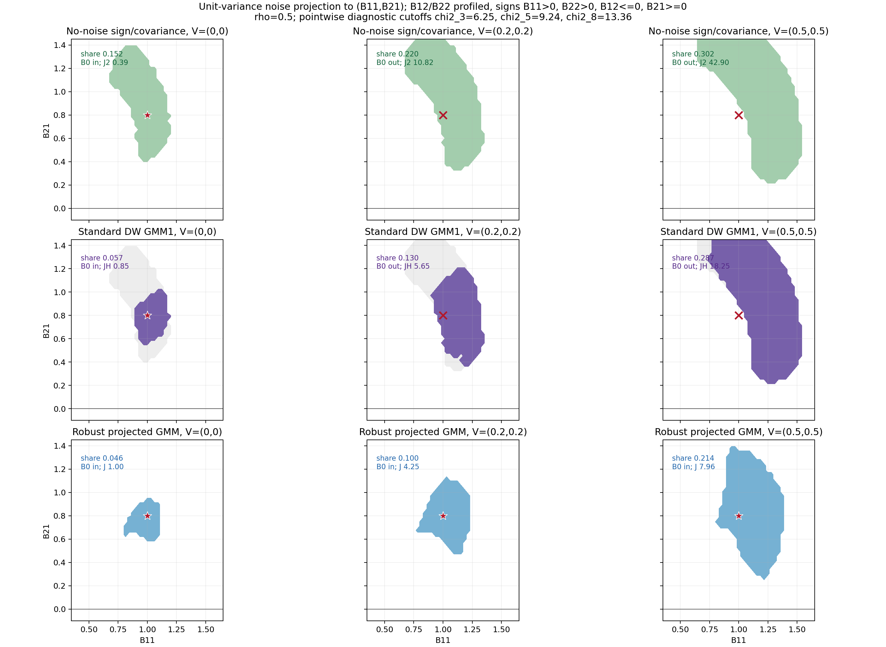
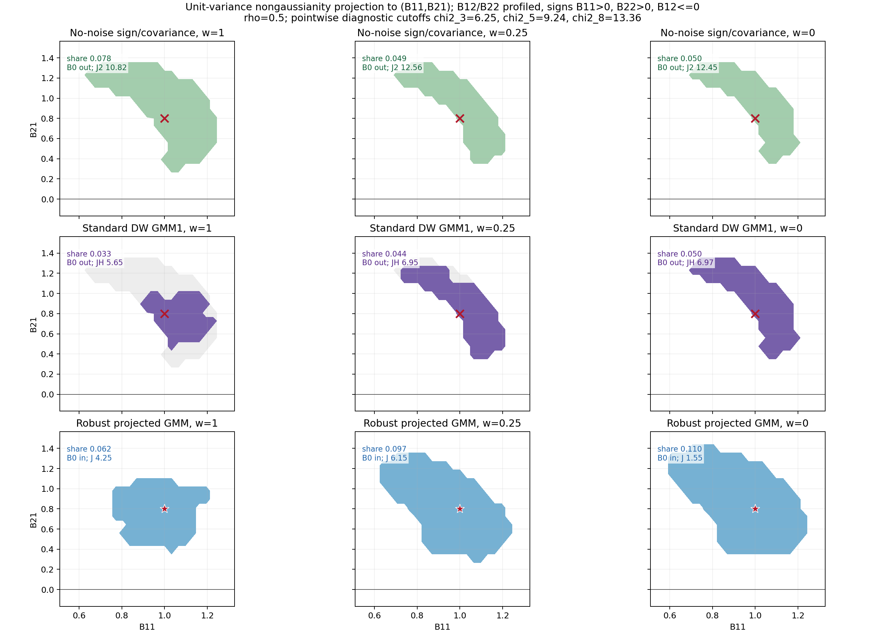
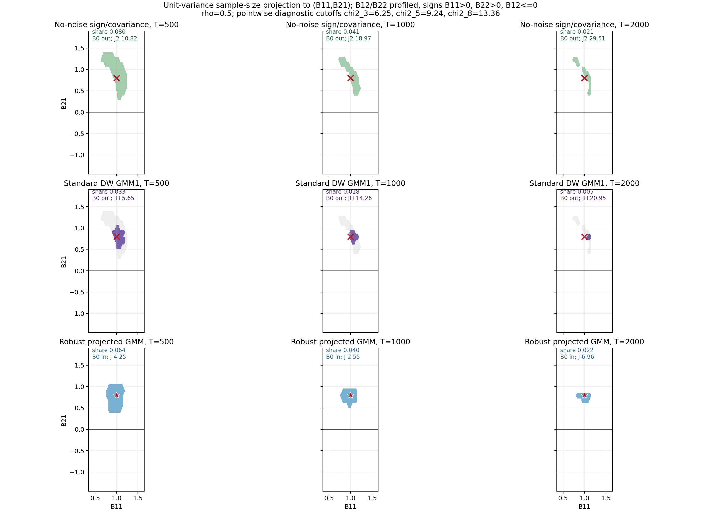

# Noise-Robust Sign-Restricted SVARs

Author: TODO

Date: 2026-06-05

## Abstract

Sign restrictions set-identify structural impact matrices by combining
economically motivated signs with the requirement that recovered structural
shocks are mutually uncorrelated. In non-Gaussian SVARs, this set can be
sharpened by imposing higher-order independence restrictions in the spirit of
Drautzburg and Wright. This paper shows that idiosyncratic residual noise can
break both steps. If the observed residual is
\(u_t=B_0\varepsilon_t+\eta_t\), a standard no-noise sign-restricted SVAR
matches the covariance of \(u_t\), not the covariance of the structural signal
\(B_0\varepsilon_t\). The resulting identified set can be biased and need not
contain the true impact matrix. Higher-moment refinement can then sharpen the
wrong target, producing a small accepted set that looks precise while moving
further away from the structural object of interest. This paper proposes a
noise-robust refinement that separates non-Gaussian structural shocks from
Gaussian residual noise under the unit-variance normalization
\(E[\varepsilon_t\varepsilon_t']=I\). The researcher states a maximum ratio of
residual-noise variance to structural-signal variance, treats residual-noise
variances as nuisance parameters, and uses higher-moment restrictions in a
standard GMM criterion over \((B,\nu)\). Figures 1-3 plus Table 1 now use a
first-shock chart that displays \((B_{11},B_{21})\), profiles \(B_{12}\),
\(B_{22}\), and \(\lambda\), and imposes only \(B_{11}>0\), \(B_{22}>0\), and
\(B_{12}\le0\) as maintained sign restrictions. The plotted and tabulated
quadratic criteria use candidate-specific pointwise covariance weights. The
evidence remains diagnostic because the displayed inversions use pointwise
chi-square cutoffs; a final projected critical-value route remains a follow-up
before confidence-set claims are made.

<!-- SOURCE-TRAIL: Use the M71 corrected first-shock evidence rebuild, the M66 noise-ratio derivation, M49 for the source-correct GMM1 menu, M56 for generated-moment inference, and M52 only as historical evidence. -->
<!-- CONTRIBUTION-NOTE: The abstract's original contribution is the residual-noise pseudo-set warning and the DW-versus-robust-DW comparison diagnostic. -->

## 1. Introduction

Sign-restricted SVARs are popular because they identify structural shocks with
relatively little economic structure. Once the reduced-form residual \(u_t\) is
available, the researcher searches for impact matrices \(B\) such that the
recovered shocks \(e_t(B)=B^{-1}u_t\) have covariance \(I\) and the entries of
\(B\) satisfy economically motivated sign restrictions. Compared with
recursive zero restrictions or external instruments, this looks robust: the
researcher does not choose a recursive ordering or a single proxy, but reports
the set of impact matrices consistent with signs and orthogonality.

<!-- SOURCE-TRAIL: Use sign-restriction overview sources, `kilian2016StructuralVectorAutoregressiveAnalysis93b03b`, and `arias2018InferenceBasedStructuralVector`. -->

This paper shows that the same orthogonality requirement becomes fragile when
the observed residual contains idiosyncratic noise. In the simultaneous
impact model
\[
u_t=B_0\varepsilon_t+\eta_t,
\]
\(B_0\varepsilon_t\) is the structural signal and \(\eta_t\) is residual noise.
A standard sign-restricted SVAR that ignores \(\eta_t\) treats \(u_t\) as if it
were entirely structural signal. Even at the true impact matrix, the recovered
object \(B_0^{-1}u_t=\varepsilon_t+B_0^{-1}\eta_t\) need not have uncorrelated
components. Equivalently, the usual covariance factor is a factor of
\(B_0B_0' + V\), not a factor of \(B_0B_0'\). The sign-restricted set is then
identified from the wrong covariance object and may no longer contain the true
impact matrix, even in population.

<!-- SOURCE-TRAIL: Use `vault/syntheses/Noisy residuals in recursive and sign-restricted SVARs.md` and the M25 column-rescaling obstruction. -->

The problem becomes sharper once higher moments are used for refinement. The
motivation for Drautzburg-Wright-style refinement is clear in a no-noise SVAR:
sign restrictions often leave a wide set, while non-Gaussian structural shocks
carry additional information about independence beyond zero covariance. A
researcher can therefore discard sign-admissible impact matrices whose
recovered shocks are uncorrelated but still dependent at third or fourth
order. Under residual noise, however, the refinement is applied to shocks
recovered from a misspecified no-noise model. It can reject the true impact
matrix and select a small region around a noisy pseudo-target. The visual
danger is a false sense of precision: the accepted set gets smaller, but the
target being sharpened is no longer the structural target.

<!-- SOURCE-TRAIL: Use `drautzburg2023RefiningSetIdentificationVars` for the maintained-null comparator and `manuscript/derivations/standard-dw-j-test-under-noise.md` for the M25 working misspecification result. -->
<!-- TODO-NOTE: Do not promote the generic emptying result to theorem wording until the M25 proof audit is complete. -->

The proposed solution keeps the logic of sign restrictions but changes the
maintained model. Instead of pretending that all variation in \(u_t\) is
structural signal, the researcher reports impact matrices that are compatible
with signs, with diagonal Gaussian residual noise, and with an explicit
residual-noise-to-signal bound. In the bivariate version used here, the
dimensionless bound is written as
\(\lambda_i=\nu_i/(BB')_{ii}\le\rho\): residual-noise variance in coordinate
\(i\) can be at most a fraction \(\rho\) of the corresponding structural-signal
variance. This bound makes the sign-restricted set robust to noise up to the
specified ratio. It also makes the cost transparent. A larger allowed noise
ratio gives a more robust but wider set; a smaller ratio gives more precision
but requires a stronger signal-to-noise assumption.

The higher-moment part of the solution exploits a simple cumulant fact. If
residual noise is Gaussian and independent of the structural shocks, it changes
second moments but has no cumulants above order two. Mixed third and fourth
cumulants of \(B^{-1}u_t\) can therefore be used to refine the noise-robust
sign set without reusing the invalid no-noise covariance restriction. This is
the sense in which the robust DW refinement separates non-Gaussian structural
shocks from Gaussian residual noise. It does not claim that higher moments
always give a sharp estimator. When structural shocks are nearly Gaussian, the
robust set widens, and that widening is part of the diagnostic.

<!-- SOURCE-TRAIL: Use `manuscript/derivations/dw-noise-robust-moments.md`, `manuscript/derivations/dw-robust-comparison-diagnostic.md`, and higher-moment SVAR caution sources. -->

The current simulation evidence uses the M71 corrected first-shock chart.
Figures 1-3 report accepted projections to \((B_{11},B_{21})\), profile
\(B_{12}\), \(B_{22}\), and \(\lambda\), and impose the maintained sign screen
\(B_{11}>0\), \(B_{22}>0\), and \(B_{12}\le0\). Figure 1 varies Gaussian
residual noise; Figure 2 weakens structural non-Gaussianity; Figure 3 varies
sample size. Across the noisy rows, the standard no-noise and standard-DW
screens can reject the full true impact matrix while the robust projected set
often remains truth-containing. Table 1 shows the same comparison in a
lightweight Monte Carlo using candidate-specific pointwise weights. The
recommendation is diagnostic: report the standard DW set and the robust DW set
together, and treat standard DW precision unsupported by the robust set as a
warning sign.

<!-- SOURCE-TRAIL: Use M71 for the rebuilt Figures 1-3 and Monte Carlo table, M66 for the lambda-bound algorithm, and M52 only as historical evidence. -->

### 1.1 Literature Positioning

This paper is closest to three literatures, but it uses them for a narrow
robustness question rather than for a broad survey. The first is the
sign-restricted SVAR literature. In that literature, sign restrictions describe
sets of admissible rotations, and careful reporting matters because selected
rotations or point summaries can understate set uncertainty. This paper accepts
that set-based starting point. Its additional question comes one step earlier:
if the covariance factor being rotated is a factor of \(B_0B_0' + V\), then even
the population sign set is already a noisy pseudo-set.

<!-- SOURCE-TRAIL: Use `kilian2016StructuralVectorAutoregressiveAnalysis93b03b` for sign-restriction geometry and `arias2018InferenceBasedStructuralVector` for set-inference and reporting cautions. -->
<!-- CONTRIBUTION-NOTE: The covariance-target contamination question is this manuscript's contribution, not a claim inherited from standard sign-restriction inference. -->

The second comparator is Drautzburg and Wright's independence refinement. Their
procedure is the right benchmark because it takes a sign-restricted set and
uses higher-moment independence restrictions to refine it under a maintained
no-noise model. This paper does not claim that refinement is invalid under
that model. It asks what the same researcher-facing refinement reports when
the reduced-form residual includes additive noise and the no-noise covariance
target is misspecified. The standard-DW set is therefore used as a
maintained-null comparator, while the robust set is a diagnostic object to
report beside it.

<!-- SOURCE-TRAIL: Use `drautzburg2023RefiningSetIdentificationVars` for the no-noise comparator and `manuscript/derivations/standard-dw-j-test-under-noise.md` for the manuscript's residual-noise misspecification route. -->
<!-- TODO-NOTE: Keep theorem-level claims about generic standard-DW emptying conditional on the M25 proof audit. -->

The third connection is the higher-moment SVAR and GMM literature. Those papers
show that non-Gaussian moments can carry structural information, but they also
make the assumptions and weak-moment risks explicit. The robust DW set follows
that discipline: it writes mixed higher cumulants as moment restrictions, uses
a GMM-style inversion language, and treats weak or Gaussian structural shocks
as an honest widening case. The robust set is not advertised as a uniformly
sharper estimator. It is meant to reveal when standard-DW precision depends on
a noisy covariance target that the robust moments do not support.

<!-- SOURCE-TRAIL: Use `guay2020IdentificationStructuralVectorAutoregressions`, `paper2020GeneralizedMethodMomentsEstimator`, `olea2022SvarIdentificationHigherMoments`, and `lewis2025IdentificationBasedHigherMoments`. -->
<!-- CONTRIBUTION-NOTE: The original contribution is the DW-versus-robust-DW comparison under residual noise, not the general idea that higher moments can identify SVARs. -->

The paper is organized around this comparison. Figure 1 varies Gaussian
residual noise and shows the main warning with the unit-variance projected
implementation: the no-noise and standard-DW rows reject the full true impact
matrix once residual noise is present, while the robust projected row remains
truth-containing after profiling admissible \(\lambda\). Figure 2 holds
residual noise fixed and weakens structural non-Gaussianity, showing the
limitation that robust DW's higher-cumulant component needs informative higher
moments. Figure 3 asks whether the comparison tightens with sample size, and
Table 1 repeats the same sign screen and first-shock chart in a Monte Carlo
diagnostic.

<!-- SOURCE-TRAIL: Use M71 for the current Figures 1-3 and Table 1; retain the projected critical-value choice as a follow-up inference task. -->

<!-- SOURCE-TRAIL: Use sign-restriction overview sources, Drautzburg-Wright, and the noisy-residual synthesis. -->
<!-- CONTRIBUTION-NOTE: The original contribution is the noise-bias warning plus the standard-DW versus robust-DW comparison. -->

## 2. Sign Restrictions and Noisy SVARs

This section starts with the standard object and then adds noise. The main text
uses a bivariate simultaneous impact model. There are no VAR lags, dynamic
impulse responses, or horizon-specific restrictions in the first version of
the paper. The residual \(u_t\) is already in hand, and the question is which
impact matrices can be reported from it.

In the no-noise benchmark,

\begin{equation}
u_t = B_0\varepsilon_t,\qquad
E(\varepsilon_t)=0,\qquad
E(\varepsilon_t\varepsilon_t')=I .
\end{equation}

The matrix \(B_0\) is the structural impact matrix. The vector
\(\varepsilon_t=(\varepsilon_{1t},\varepsilon_{2t})'\) contains structural
shocks normalized to have unit variances and zero covariance. For any candidate
impact matrix \(B\), the recovered shocks are

\begin{equation}
e_t(B)=B^{-1}u_t .
\end{equation}

A sign-restricted SVAR keeps candidates whose recovered shocks have the same
unit-variance covariance matrix as the structural shocks and whose impact
matrix satisfies the chosen sign restrictions. If \(R(B)\ge0\) denotes the sign
screen, the population no-noise set is

\begin{equation}
\mathcal S_0 =
\{B:\ R(B)\ge0,\quad E[e_t(B)e_t(B)']=I\}.
\label{eq:no-noise-sign-j-set}
\end{equation}

If \(B_0\) satisfies the sign restrictions, then \(B_0\in\mathcal S_0\)
because \(e_t(B_0)=\varepsilon_t\) and the normalization above gives
\(E[\varepsilon_t\varepsilon_t']=I\). This J-test representation is the object
we will invert in finite samples.

Now suppose the observed residual contains additive residual noise:

\begin{equation}
u_t = B_0\varepsilon_t+\eta_t,\qquad
E(\eta_t)=0,\qquad
E(\eta_t\eta_t')=V=\operatorname{diag}(\nu_1,\nu_2).
\end{equation}

The residual noise is independent of the structural shocks. The diagonal
matrix \(V\) records idiosyncratic residual-noise variances in the coordinates
of \(u_t\).

The covariance of the observed residual is

\begin{equation}
\Sigma_u=E(u_tu_t')=B_0B_0'+V .
\end{equation}

If the researcher ignores \(\eta_t\), the standard sign-restricted SVAR treats
\(\Sigma_u\) as if it were generated only by structural shocks. That changes
the object being identified. At the true impact matrix,

\begin{equation}
e_t(B_0)=B_0^{-1}u_t
=\varepsilon_t+B_0^{-1}\eta_t ,
\end{equation}

so the recovered-shock covariance is

\begin{equation}
E[e_t(B_0)e_t(B_0)']
= I+B_0^{-1}VB_0^{-1'} .
\end{equation}

Consequently \(B_0\) generally fails the no-noise condition in
\eqref{eq:no-noise-sign-j-set}. Any nonzero diagonal element of
\(B_0^{-1}VB_0^{-1'}\) violates the unit-variance part of
\(\mathcal S_0\), and any nonzero off-diagonal element also makes the recovered
components correlated. The issue is not that the noisy model is incoherent.
The issue is that \(\mathcal S_0\) is constructed to find candidates whose
recovered residuals look like unit-variance, mutually uncorrelated structural
shocks. Under residual noise, \(e_t(B_0)\) no longer has that covariance
matrix.

Thus, without modeling residual noise, the reported sign-restricted set is
shifted away from the structural impact matrix. In extreme cases the shift can
cross a sign boundary: the noisy covariance may make every candidate satisfying
the no-noise unit-variance and zero-covariance target put a disputed entry on
the wrong side of zero.

In finite samples the same idea can be written as a J-test inversion. For a
candidate \(B\), let

\begin{equation}
\widehat m_{2,T}(B)=
\begin{bmatrix}
T^{-1}\sum_{t=1}^T e_{1t}(B)^2-1\\
T^{-1}\sum_{t=1}^T e_{2t}(B)^2-1\\
T^{-1}\sum_{t=1}^T e_{1t}(B)e_{2t}(B)
\end{bmatrix}.
\end{equation}

These are the two unit-variance moments and the covariance moment implied by
\eqref{eq:no-noise-sign-j-set}. A no-noise sign-restricted inversion
accepts candidates satisfying

\begin{equation}
\mathcal S_{J,T}(c_2)=
\left\{
B:\ R(B)\ge0,\quad
J_{2,T}(B)=T\widehat m_{2,T}(B)'\widehat W_{2,T}\widehat m_{2,T}(B)\le c_2
\right\}.
\end{equation}

With the usual efficient weighting matrix and standard regularity conditions,
the statistic evaluated at the true \(B_0\) under the no-noise null has the
pointwise limit \(\chi^2_3\), one degree for each moment in
\(\widehat m_{2,T}\). For a level-\(\alpha\) inversion, \(c_2\) can therefore
be taken as the \(1-\alpha\) quantile of \(\chi^2_3\). The J-test view makes
the source of bias explicit: in the noisy model, the no-noise vector
\(E[e_t(B_0)e_t(B_0)']-I\) is generally not zero. The first row of Figure 1
shows this unit-variance version of the bias: the no-noise sign/covariance
target rejects the full true \(B_0\) once residual noise is present, before
higher moments are used.

<!-- SOURCE-TRAIL: Use the proposal note, `Noisy residuals in recursive and sign-restricted SVARs.md`, and the M25 column-rescaling obstruction. -->
<!-- DESIGN-NOTE: Keep the paper simultaneous and impact-only. Treat \(u_t\) as given; do not introduce VAR lag equations, dynamic IRFs, or horizon-specific sign restrictions in this version. -->
<!-- SOURCE-TRAIL: Use M71 for the rebuilt unit-variance residual-noise Figure 1. -->

## 3. Drautzburg-Wright Refinement Under Noise

The previous section used only second moments. Drautzburg-Wright-style
refinement adds higher moments to exploit non-Gaussian structural shocks. The
logic in the no-noise case is easiest to see from the recovered shocks
\(e_t(B)=B^{-1}u_t\). A candidate can satisfy the second-moment restrictions in
\(\mathcal S_0\), so that the recovered shocks have covariance \(I\), while
still mixing the independent structural shocks. DW refinement keeps the
second-moment sign set but removes candidates whose recovered shocks are
uncorrelated and dependent.

<!-- SOURCE-TRAIL: M52 rebuilt the simulation code with the M49 source-correct bivariate Drautzburg-Wright GMM1 higher-moment menu plus a separate B-plane covariance screen. -->

DW measures this remaining dependence with third- and fourth-order
co-moments of the recovered shocks. With the same recovered-shock notation as
Section 2, the bivariate GMM1 higher-moment menu is

\begin{equation}
g_{DW,1}(B)=
\begin{bmatrix}
E\{e_{1t}(B)^2e_{2t}(B)\}\\
E\{e_{1t}(B)e_{2t}(B)^2\}\\
E\{e_{1t}(B)^3e_{2t}(B)\}\\
E\{e_{1t}(B)^2e_{2t}(B)^2\}-1\\
E\{e_{1t}(B)e_{2t}(B)^3\}
\end{bmatrix}.
\end{equation}

The corresponding GMM2 menu drops only the symmetric fourth product
\(E\{e_{1t}(B)^2e_{2t}(B)^2\}-1\), which allows the two structural shocks to be
driven by the same volatility process.

In the no-noise model, \(g_{DW,1}(B_0)=0\). A sample DW inversion refines the
second-moment set by keeping candidates that pass both the unit-variance
second-moment test and the higher-moment test:

\begin{equation}
\mathcal D_T(c_2,c_S)=
\left\{
B\in\mathcal S_{J,T}(c_2):\quad
J_{S,T}(B)=T\widehat g_{DW,T}(B)'\widehat W_{S,T}
\widehat g_{DW,T}(B)\le c_S
\right\}.
\label{eq:standard-dw-j-test-inversion}
\end{equation}

With the usual efficient weighting matrix, \(J_{S,T}(B_0)\) has a pointwise
\(\chi^2_5\) limit under the no-noise GMM1 null, so \(c_S\) can be chosen as a
chi-square critical value for the five higher-moment entries. The important
object is the refinement: \(\mathcal D_T(c_2,c_S)\) is a subset of
\(\mathcal S_{J,T}(c_2)\) that discards candidates whose recovered shocks are
uncorrelated but still dependent.

This is useful under the maintained no-noise null. Under residual noise, it can
produce a narrow and misleading set. Section 2 already showed why \(B_0\) is
generally shifted out of \(\mathcal S_0\) when the no-noise unit-variance
moments are applied to noisy residuals. Since DW refinement is a refinement of
that second-moment set, the refined set can become smaller while still missing
\(B_0\). The second row of Figure 1 shows this warning in the unit-variance
projection: in the no-noise column, non-Gaussianity sharpens the sign set;
once residual noise is added, the standard-DW projection can remain visually
sharp while the full true impact matrix fails the standard no-noise test.

<!-- SOURCE-TRAIL: Use Drautzburg-Wright, higher-moment SVAR caution sources, and the noisy-residual synthesis. -->
<!-- SOURCE-TRAIL: Use `derivations/standard-dw-j-test-under-noise.md` for the M25 J-test inversion result: rich-stack generic emptying, structural-rescaling exceptions, finite-moment aliases, and least-rejected pseudo-candidates. -->
<!-- SOURCE-TRAIL: Use `derivations/m47-standard-dw-proof-gate-audit.md` for the M47 conditional pass: rich-stack/ICA proof gate, compactness condition, structural-coordinate rescaling exception, and finite-GMM1 alias limitation. -->
<!-- SOURCE-TRAIL: Use `derivations/m49-dw-source-and-noisy-moment-audit.md` for the source-correct bivariate GMM1/GMM2 moment menus and `simulations/m52_source_correct_evidence.md` for the implemented GMM1 rebuild. -->

## 4. Noise-Robust Sign and DW Sets

The robust construction begins by changing the null model for sign
restrictions. Instead of requiring the residual covariance to be explained
entirely by structural shocks, the researcher allows part of each residual
variance to be idiosyncratic noise. The normalization remains
\(E[\varepsilon_t\varepsilon_t']=I\). We do not impose
\(\operatorname{diag}(B)=1\).

Let \(\Sigma_u=E[u_tu_t']\), with entries \(\sigma_{ij}\). Under the model
\(u_t=B_0\varepsilon_t+\eta_t\) and diagonal residual noise,

\begin{equation}
\Sigma_u = B_0B_0' + V,\qquad
V=\operatorname{diag}(\nu_1,\nu_2).
\end{equation}

For a candidate \(B\), introduce candidate residual-noise variances
\(\nu=(\nu_1,\nu_2)'\) and \(V(\nu)=\operatorname{diag}(\nu_1,\nu_2)\). These
variances are measured in the coordinates of the reduced-form residual
\(u_t\). The structural shocks have unit variances, but the structural signal
in residual coordinate \(i\) is \((B\varepsilon_t)_i\), whose variance is
\((BB')_{ii}\). The dimensionless noise share is therefore

\begin{equation}
\lambda_i(B,\nu)=\frac{\nu_i}{(BB')_{ii}}.
\end{equation}

The noise-robust second-order restriction is

\begin{equation}
\Psi_2(B,\nu)
=\operatorname{vech}\{\Sigma_u-BB'-V(\nu)\}=0,
\qquad
0\le \lambda_i(B,\nu)\le \rho,\quad i=1,2.
\label{eq:relative-noise-covariance-screen}
\end{equation}

Equivalently, write \(\nu_i(B,\lambda)=\lambda_i(BB')_{ii}\) with
\(\lambda_i\in[0,\rho]\). This is the clean derivation of the
residual-noise-to-signal screen. The matrix \(\Sigma_u-BB'\) is the residual
covariance left over after candidate structural signal \(BB'\) is removed. In
the diagonal-noise model, that leftover covariance must be diagonal and
nonnegative; the ratio bound is entrywise. A direct absolute cap
\(0\le\nu_i\le\rho\) would be a different restriction unless the residual
coordinates were separately standardized. The sample version replaces
\(\Sigma_u\) by \(\widehat\Sigma_u=T^{-1}\sum_t u_tu_t'\).

The next step is to regain some of the efficiency lost by allowing noise. Keep
the same recovered-shock notation as before:

\begin{equation}
e_t(B)=B^{-1}u_t
=B^{-1}B_0\varepsilon_t+B^{-1}\eta_t .
\end{equation}

For a candidate pair \((B,\nu)\) satisfying the second-order model, the
covariance of the recovered residual is the parameter-implied matrix

\begin{equation}
\Omega_e(B,\nu)
=E[e_t(B)e_t(B)']
=I+B^{-1}V(\nu)B^{-1'} .
\end{equation}

Write its entries as \(\omega_{ij}(B,\nu)\). These entries are not estimated as
separate sample plug-ins inside the fourth-order moments. They are smooth
functions of the candidate impact matrix and residual-noise variances.

The robust higher-moment route uses the following maintained condition.

*Assumption 1 (`ass:gaussian-residual-noise`, robust-noise condition). The
residual noise is independent of the structural shocks and Gaussian. Therefore
every linear transform \(B^{-1}\eta_t\) contributes only through first and
second moments. This assumption makes the displayed transformed higher-order
moment conditions robust to Gaussian noise; it does not make recovered-shock
variances or recovered-shock covariances equal to their no-noise targets.*

Under Assumption 1, \(B_0^{-1}\eta_t\) is Gaussian. Gaussian variables have no
cumulants above order two, and cumulants of independent sums add. Since the
structural shocks are mutually independent, every mixed higher cumulant of
\(e_t(B_0)=\varepsilon_t+B_0^{-1}\eta_t\) vanishes. This is the population
reason the robust higher-moment restrictions hold at \(B_0\).

For third-order entries, the mixed cumulants are just centered third moments,
so the restrictions can be written as \(E\{e_1(B)^2e_2(B)\}=0\) and
\(E\{e_1(B)e_2(B)^2\}=0\). Fourth-order entries subtract the covariance
products implied by \(\Omega_e(B,\nu)\). The Gaussian-noise-blind moment stack
is

\begin{equation}
G_H(B,\nu)=
\begin{bmatrix}
E\{e_1(B)^2e_2(B)\}\\
E\{e_1(B)e_2(B)^2\}\\
E\{e_1(B)^3e_2(B)\}-3\omega_{11}(B,\nu)\omega_{12}(B,\nu)\\
E\{e_1(B)^2e_2(B)^2\}
-\omega_{11}(B,\nu)\omega_{22}(B,\nu)-2\omega_{12}(B,\nu)^2\\
E\{e_1(B)e_2(B)^3\}-3\omega_{22}(B,\nu)\omega_{12}(B,\nu)
\end{bmatrix}.
\label{eq:dw-higher-cumulant-moment-stack}
\end{equation}

The first two entries are centered third-product conditions. The last three
entries are fourth-order conditions with covariance-product subtractions. The
important change is that the covariance terms are parameter-implied functions
of \((B,\nu)\), not sample averages multiplied after the fact. This makes the
sample criterion a standard GMM criterion in the enlarged parameter vector.
For example, the \(1222\) row becomes

\begin{equation}
\widehat g_{1222,T}(B,\nu)
=T^{-1}\sum_t \widetilde e_{1t}(B)\widetilde e_{2t}(B)^3
-3\omega_{12}(B,\nu)\omega_{22}(B,\nu),
\end{equation}

where tildes denote sample-centering of the recovered residuals.

Combine the second-order and higher-order restrictions in one moment vector

\begin{equation}
\psi_t(B,\nu)=
\begin{bmatrix}
\operatorname{vech}\{u_tu_t'-BB'-V(\nu)\}\\
e_{1t}(B)^2e_{2t}(B)\\
e_{1t}(B)e_{2t}(B)^2\\
e_{1t}(B)^3e_{2t}(B)-3\omega_{11}(B,\nu)\omega_{12}(B,\nu)\\
e_{1t}(B)^2e_{2t}(B)^2
-\omega_{11}(B,\nu)\omega_{22}(B,\nu)-2\omega_{12}(B,\nu)^2\\
e_{1t}(B)e_{2t}(B)^3-3\omega_{22}(B,\nu)\omega_{12}(B,\nu)
\end{bmatrix}.
\end{equation}

Let \(\widehat g_T(B,\nu)=T^{-1}\sum_t\psi_t(B,\nu)\). A standard efficient
GMM inversion uses

\begin{equation}
J_T(B,\nu)
=T\widehat g_T(B,\nu)'\widehat W_T\widehat g_T(B,\nu),
\end{equation}

where \(\widehat W_T\) is the inverse of the estimated covariance matrix of
\(\psi_t(B,\nu)\), usually obtained from a preliminary GMM step. The reported
noise-robust set projects this enlarged GMM confidence set onto \(B\):

\begin{equation}
\mathcal R_T(c;\rho)=
\left\{
B:\ \exists \lambda\in[0,\rho]^2\ \text{such that}\ R(B)\ge0,
J_T(B,\nu(B,\lambda))\le c
\right\}.
\end{equation}

This display treats the sign screen and the noise-share bound as hard
maintained restrictions. Computationally, for a fixed \(\rho\), the researcher
searches over \(B\) and over admissible \(\lambda\), sets
\(\nu_i(B,\lambda)=\lambda_i(BB')_{ii}\), computes the full GMM criterion, and
keeps \(B\) if at least one admissible \(\lambda\) has
\(J_T(B,\nu(B,\lambda))\le c\). Showing several values of \(\rho\) means
repeating this projected inversion as a sensitivity exercise.

At the true parameter \((B_0,\nu_0)\), the second-order block is zero by
\(\Sigma_u=B_0B_0'+V(\nu_0)\), and the higher-order block is zero by the
Gaussian-noise cumulant argument. This construction is not a no-noise
covariance factorization and not a diagonal impact normalization. It is a
standard GMM formulation of the noise-robust null, with residual-noise
variances treated as nuisance parameters and projected out when reporting the
set for \(B\).

<!-- SOURCE-TRAIL: Use `derivations/dw-noise-robust-moments.md`, `derivations/m40-variance-ratio-robust-dw-screen-audit.md`, `derivations/m66-noise-ratio-bound-grid-algorithm.md`, Drautzburg-Wright, and higher-moment GMM sources. -->
<!-- TODO-NOTE: M71 rebuilds Figures 1-3 and the Monte Carlo table under the unit-variance projected GMM algorithm with the corrected first-shock chart and candidate-specific pointwise weights. -->
<!-- TODO-NOTE: The exact projection critical value for \(\mathcal R_T(c;\rho)\) needs a compact inference note after the enlarged GMM implementation is audited. -->

## 5. Monte Carlo Robustness Check

This section uses the M71 corrected first-shock evidence rebuild. Figures 1-3
and Table 1 use the unit-variance projected GMM route from Section 4. The
maintained sign restrictions are \(B_{11}>0\), \(B_{22}>0\), and
\(B_{12}\le0\). The displayed figure coordinates are \((B_{11},B_{21})\), the
impact of the first structural shock on the two residual coordinates; the
remaining impact entries and the nuisance noise shares are profiled. The
figures and table are diagnostic inversions with candidate-specific pointwise
covariance weights and pointwise chi-square cutoffs, not final projected
confidence sets.

<!-- SOURCE-TRAIL: Use M27 for the common reporting chart, accepted shares, overlap, warning-rate, and truth-inclusion diagnostics. -->

### 5.1 Residual-Noise Grid

Figure 1 keeps the reader job of the residual-noise grid: residual noise
increases across columns. The chart is the projection to
\((B_{11},B_{21})\), while \(B_{12}\), \(B_{22}\), and
\(\lambda\in[0,\rho]^2\) are searched internally. A star means the full true
\(B_0\) passes that row's test; an x means the true first-shock coordinate may
sit in a shaded cell only because another profiled pair at that projection is
accepted.

**Figure 1. Unit-variance residual-noise grid.** The robust row uses the M66
restriction \(\lambda_i=\nu_i/(BB')_{ii}\in[0,\rho]\) and reports the
projection of accepted \((B,\lambda)\) pairs to the first-shock coordinates
\((B_{11},B_{21})\). The sign screen is \(B_{11}>0\), \(B_{22}>0\),
\(B_{12}\le0\). In the displayed moderate- and high-noise draws, the full true
\(B_0\) fails the no-noise standard rows but passes the robust projected row.
The plotted \(J\) statistics use candidate-specific pointwise covariance
weights for this diagnostic figure; the final projected critical-value choice
remains follow-up inference work.

<!-- SOURCE-TRAIL: Figure file `figures/fig_sign_dw_unit_variance_noise_grid.png`; generator `simulations/sign_dw_unit_variance_noise_grid_figure.py`; diagnostic note `simulations/sign_dw_unit_variance_noise_grid_figure.md`; machine-readable output `simulations/output/sign_dw_unit_variance_noise_grid_figure.json`; M66 derivation `derivations/m66-noise-ratio-bound-grid-algorithm.md`; M49 source audit `derivations/m49-dw-source-and-noisy-moment-audit.md`; M56 generated-moment audit `derivations/m56-robust-cumulant-gmm-generated-moment-audit.md`. -->

M52 checked the finite-sample logic for the old source-correct statistic. Its
numbers remain useful for audit history, but M71 supersedes them as active
evidence for the M66 unit-variance GMM object.

### 5.2 Non-Gaussianity Grid

Figure 2 keeps residual noise fixed and weakens structural non-Gaussianity
across columns. It uses the same first-shock chart, sign screen, and projected
\((B,\lambda)\) search as Figure 1.

**Figure 2. Unit-variance non-Gaussianity grid.** The robust row uses the M66
\(\lambda\)-bounded projected GMM algorithm and the M71 corrected first-shock chart. The
robust row remains truth-containing in the displayed draws, but it widens as
the structural shocks become less non-Gaussian. That widening is the intended
limitation diagnostic: when higher cumulants carry little information, the
robust set stops pretending otherwise.

<!-- SOURCE-TRAIL: Figure file `figures/fig_sign_dw_unit_variance_nongaussianity_grid.png`; generator `simulations/sign_dw_unit_variance_noise_grid_figure.py --scenario-set nongaussianity`; diagnostic note `simulations/sign_dw_unit_variance_nongaussianity_grid_figure.md`; machine-readable output `simulations/output/sign_dw_unit_variance_nongaussianity_grid_figure.json`. -->

This limitation matters for the paper's recommendation. A wide robust set is
not a failed diagnostic by itself. It records the information deliberately lost
by dropping the noisy recovered-shock covariance target and profiling diagonal
noise variances. The warning object is directional: standard-DW accepted mass
outside the robust-DW set, or standard-DW rejection of the truth in simulations
when robust DW still contains it.

<!-- SOURCE-TRAIL: Use `manuscript/derivations/dw-robust-comparison-diagnostic.md` for the directional interpretation rule. -->

### 5.3 Sample-Size Grid

Figure 3 holds residual noise and structural non-Gaussianity fixed while
\(T\) varies. It asks whether the displayed accepted projections tighten as
sample size increases when the maintained model is correct for the robust row
and misspecified for the no-noise standard rows.

**Figure 3. Unit-variance sample-size grid.** The robust row again uses the M66
\(\lambda\)-bounded projected GMM algorithm and the M71 corrected first-shock chart. In
the displayed noisy draws, standard DW becomes more visibly centered on the
wrong no-noise target as \(T\) grows, while the robust row keeps the full true
\(B_0\) admissible and tightens around the noise-aware target.

<!-- SOURCE-TRAIL: Figure file `figures/fig_sign_dw_unit_variance_sample_size_grid.png`; generator `simulations/sign_dw_unit_variance_noise_grid_figure.py --scenario-set sample_size`; diagnostic note `simulations/sign_dw_unit_variance_sample_size_grid_figure.md`; machine-readable output `simulations/output/sign_dw_unit_variance_sample_size_grid_figure.json`. -->

### 5.4 Monte Carlo Table

Table 1 reports the M71 corrected first-shock Monte Carlo diagnostic under the
same sign screen and projected criterion as Figures 1-3. The DW row uses the
no-noise second-order screen plus the bivariate DW GMM1 higher-moment menu.
The nrDW row searches over \((B,\lambda)\), sets
\(\nu_i=\lambda_i(BB')_{ii}\), estimates the pointwise covariance matrix at
each candidate, and evaluates the Section 4 moment vector. `DW truth` and
`nrDW truth` are full true-\(B_0\) inclusion rates for DW and nrDW. `Warning`
is the fraction of replications in which DW misses the truth while nrDW
contains it. `Sign share`, `DW share`, and `nrDW share` are accepted-set shares
on the displayed first-shock projection grid. `d_DW_not_subset_nrDW` is the
directional share of DW accepted projection mass not supported by nrDW. `DW
dist` and `nrDW dist` are average distances from the true first-shock projection
to the accepted projection set, with zero when the projected truth is accepted.

**Table 1. M71 corrected first-shock Monte Carlo diagnostic.** Entries are
evaluation averages from 6 replications per scenario on a \(13\times13\)
first-shock projection grid, profiling a \(5\times5\) grid for
\((B_{12},B_{22})\) and a \(3\times3\) grid for \(\lambda\). The cutoffs are
pointwise chi-square diagnostics for the displayed moment rows. They are not
final projected confidence-set critical values.

| Scenario | DW truth | nrDW truth | Warning | Sign share | DW share | nrDW share | d_DW_not_subset_nrDW | DW dist | nrDW dist |
|---|---:|---:|---:|---:|---:|---:|---:|---:|---:|
| No noise, strong moments | 0.667 | 0.500 | 0.000 | 0.048 | 0.020 | 0.035 | 0.133 | 0.022 | 0.018 |
| Moderate Gaussian noise | 0.167 | 0.667 | 0.667 | 0.051 | 0.019 | 0.060 | 0.000 | 0.039 | 0.000 |
| High Gaussian noise | 0.000 | 0.667 | 0.667 | 0.065 | 0.023 | 0.082 | 0.222 | 0.138 | 0.000 |
| Weak structural higher moments | 0.000 | 0.833 | 0.833 | 0.028 | 0.016 | 0.092 | 0.000 | 0.208 | 0.000 |
| Gaussian structural shocks | 0.000 | 0.833 | 0.833 | 0.027 | 0.020 | 0.090 | 0.167 | 0.220 | 0.000 |
| Skewed residual noise | 0.333 | 0.833 | 0.667 | 0.052 | 0.020 | 0.058 | 0.033 | 0.054 | 0.000 |

<!-- SOURCE-TRAIL: M71 corrected run in `simulations/m68_first_shock_evidence.md` and machine-readable output `simulations/output/m68_first_shock_evidence.json`. Historical M52 outputs remain in `simulations/m52_source_correct_evidence.md` and `simulations/output/m52_source_correct_evidence.json` but use the old pre-M64 chart. -->

The skewed-residual-noise row is a stress case, not validation of the robust
Gaussian-noise route. It violates Assumption 1, so its favorable truth-inclusion
numbers should not be read as evidence that the same cumulant argument covers
non-Gaussian residual noise without additional restrictions.

The no-noise row also shows why the table should be read as a lightweight
diagnostic rather than final inference: the pointwise chi-square cutoff is
close to the finite-sample distribution of the profiled nrDW truth statistic
in this small run. The next inference task is therefore not another chart
normalization change, but a projected critical-value note for the enlarged
\((B,\lambda)\) inversion.

### 5.5 Detailed Sample-Size Monte Carlo

The longer sample-size Monte Carlo isolates the Figure 3 design and reruns it
with 500 replications per sample size on an intermediate grid. The preferred
version of this experiment is the cleaned iid design from M78. It keeps the
M74 grid and reporting surface, but removes the sample standardization,
residual demeaning, recovered-shock demeaning, and sample-specific covariance
weights that the M77 audit identified as a finite-sample calibration problem.
The data-generating process is the same across the three rows except for
\(T\). The true impact matrix is

\[
B_0=
\begin{bmatrix}
1 & -0.25\\
0.80 & 1
\end{bmatrix}.
\]

The structural shocks are generated as independent population-normalized
\(\chi^2_5\) variables,
\[
\varepsilon_{it}=\frac{\chi^2_{5,it}-5}{\sqrt{10}},
\]
and the residual-noise innovations are independent standard Gaussian variables,
independent of the structural shocks. The observed residual is

\[
u_t=B_0\varepsilon_t+
\begin{bmatrix}
\sqrt{0.2}\eta_{1t}\\
\sqrt{0.2}\eta_{2t}
\end{bmatrix},
\]

The simulated residuals are not demeaned before the criteria are evaluated.
Thus the run fixes residual noise at \(V=\operatorname{diag}(0.2,0.2)\), fixes
strong structural non-Gaussianity, and varies only
\(T\in\{500,1000,2000\}\). The base seed is 20260605; the script offsets it by
block, scenario, and replication so that each of the 1500 samples has a
recorded deterministic seed.

The candidate chart reports the first-shock projection
\((B_{11},B_{21})\). The M74 grid uses \(B_{11}\in[0.35,1.65]\),
\(B_{21}\in[-1.45,1.90]\), \(B_{12}\in[-1.10,0]\), and
\(B_{22}\in[0.55,1.45]\). It places 27 nominal points on each displayed
coordinate, 7 nominal points on each profiled impact coordinate, and 5 nominal
points on each \(\lambda_i\). Exact true coordinates and true
\(\lambda_i=\nu_i/(B_0B_0')_{ii}\) values are appended when they are not
already on the grid. In this DGP the true noise shares are
\((0.188,0.122)\), safely inside the maintained \(\rho=0.5\) bound. In the
M78 sample-size run the appended coordinates give 784 displayed projection
cells. The profiled impact coordinates are \(B_{12}\) and \(B_{22}\), with the
maintained sign and orientation screen
\(B_{11}>0\), \(B_{22}>0\), \(B_{12}\le0\), and
\(|B_{11}B_{22}-B_{12}B_{21}|>10^{-8}\). There is no sign restriction on
\(B_{21}\). For a displayed projection cell, the Sign, DW, or nrDW projection
is accepted if at least one admissible profiled candidate passes the
corresponding test.

The no-noise sign row uses the three second-moment observations
\[
(e_1^2-1,\ e_1e_2,\ e_2^2-1),
\]
where \(e_t(B)=B^{-1}u_t\) is not sample-centered. Its
pointwise diagnostic cutoff is \(\chi^2_3(0.90)=6.251\). DW first
requires that second-moment screen and then applies the source-correct
bivariate GMM1 higher-product menu
\[
(e_1^2e_2,\ e_1e_2^2,\ e_1^3e_2,\ e_1^2e_2^2-1,\ e_1e_2^3)
\]
with cutoff \(\chi^2_5(0.90)=9.236\). The nrDW row searches
\(\lambda\in[0,0.5]^2\), sets
\(\nu_i(B,\lambda)=\lambda_i(BB')_{ii}\), and evaluates the eight-row Section
4 vector: three second-order residual-covariance rows
\(\operatorname{vech}\{u_tu_t'-BB'-\operatorname{diag}(\nu)\}\) plus the five
Gaussian-noise-blind higher rows in \eqref{eq:dw-higher-cumulant-moment-stack}.
The robust cutoff is \(\chi^2_8(0.90)=13.362\). The implementation also uses a
rough covariance prefilter with tolerance 0.65 before the expensive robust
\(\lambda\) search; every reported robust acceptance still comes from the full
eight-row \(J\) statistic.

The cleaned run uses analytic iid weights rather than sample-specific
covariance estimates. Sign uses the analytic three-moment no-noise weight
\((E[f_S f_S'])^{-1}\). DW uses the analytic five-moment no-noise weight
\((E[f_{DW}f_{DW}'])^{-1}\), after the sign screen. nrDW uses the
candidate-specific analytic weight
\((E[f_t(B,\lambda)f_t(B,\lambda)'])^{-1}\), computed by polynomial expansion
from the exact univariate raw moments of the population-normalized
\(\chi^2_5\) structural shocks and Gaussian residual noise. The reported
statistic is
\[
J_T=T\widehat g_T'W(B,\lambda)\widehat g_T,
\]
with the obvious lower-dimensional weights for Sign and DW. This is a
diagnostic pointwise efficient-weight calculation, not a final
projected-confidence-set calibration.

Table 2 separates the three quantities the sample-size experiment is meant to
check for three reported approaches. `Sign` is the no-noise sign-restriction
screen alone. `DW` adds the standard no-noise Drautzburg-Wright
higher-moment refinement. `nrDW` is the noise-robust DW set over
\((B,\lambda)\). The truth columns are empirical full-\(B_0\) inclusion rates;
one minus these rates is the false-rejection rate at the true parameter. The
size columns are mean accepted projection shares, with medians in parentheses,
so smaller numbers mean more projected exclusion. The empty columns are
empty-set frequencies. `Warning` is the noise-diagnostic event that DW misses
the full true \(B_0\) while nrDW contains it.

**Table 2. M78 cleaned iid 500-replication sample-size Monte Carlo.** The run
uses the sample-size block only, \(V=\operatorname{diag}(0.2,0.2)\), strong
structural non-Gaussianity, the `27/7/5` grid, analytic iid weights, and
pointwise chi-square cutoffs.

| T | Sign truth | DW truth | nrDW truth | Sign size | DW size | nrDW size | Sign empty | DW empty | nrDW empty | Warning |
|---:|---:|---:|---:|---:|---:|---:|---:|---:|---:|---:|
| 500 | 0.124 | 0.088 | 0.884 | 0.074 (0.074) | 0.028 (0.029) | 0.063 (0.065) | 0.000 | 0.026 | 0.000 | 0.796 |
| 1000 | 0.020 | 0.010 | 0.896 | 0.039 (0.040) | 0.011 (0.011) | 0.035 (0.037) | 0.000 | 0.072 | 0.008 | 0.886 |
| 2000 | 0.000 | 0.000 | 0.900 | 0.017 (0.017) | 0.003 (0.003) | 0.021 (0.022) | 0.000 | 0.204 | 0.010 | 0.900 |

The first message is that the no-noise sign restriction already fails under
this noisy covariance target. Sign contains the full true \(B_0\) in only
0.124 of the \(T=500\) samples, 0.020 of the \(T=1000\) samples, and none of
the \(T=2000\)
samples, even though the sign-only projection never becomes empty. Its mean
accepted projection share shrinks from 0.074 to 0.017, so the baseline
no-noise sign screen becomes more selective as \(T\) grows, but around the
wrong covariance target.

The DW row mostly inherits and sharpens that second-order failure. Its
truth-inclusion rate falls from 0.088 at \(T=500\) to 0.010 at \(T=1000\) and
zero at \(T=2000\). The accepted projection share shrinks from 0.028 to 0.003,
so DW has high projection exclusion but the exclusion is aimed at the wrong
target. The empty-set rate reaches 0.204 at \(T=2000\), which is itself
evidence that the pointwise DW inversion is becoming incompatible with the
noisy data-generating process rather than simply becoming more precise.

The nrDW inversion is wider but behaves like the intended noise-aware
diagnostic. Its truth-inclusion rate is 0.884, 0.896, and 0.900 for
\(T=500,1000,2000\). The nominal robust cutoff is 13.362, and the Monte Carlo
standard error for a 0.90 inclusion rate with 500 replications is about 0.013,
so these rates are at nominal sampling error. At the same time, the mean nrDW
accepted projection share falls from 0.063 to 0.021. Thus the noise-robust set
also gains projection-exclusion strength, but it does so while retaining the
full true \(B_0\) at the intended pointwise rate.

M78 resolves the split between the earlier full-grid M74 table and the M77
pointwise audit. M74 remains useful as an implementation audit because it used
the same displayed grid but still included sample standardization, demeaning,
and sample-specific covariance weights. M77 showed at \(B_0\) that removing
those features and using analytic iid weights brings nrDW truth inclusion back
to nominal. M78 confirms the same conclusion on the full projection grid and
therefore supersedes M74 as the preferred sample-size table.

The warning rate is the clearest power-like diagnostic available from this
run. It increases from 0.796 to 0.900, meaning that as sample size grows the
DW false precision becomes easier to detect by comparing it with the nrDW set.
This is not a separate local-alternative power calculation. It is the power of
the reported comparison to flag the specific noisy-covariance
misspecification built into the sample-size DGP.

<!-- SOURCE-TRAIL: M78 output note `simulations/m78_clean_iid_full_sample_size_mc.md`; machine-readable records `simulations/output/m78_clean_iid_full_sample_size_mc.json`; runner `simulations/m78_clean_iid_full_sample_size_mc.py`; progress manifest `simulations/output/m78_clean_iid_full_sample_size_mc.progress.json`; M77 pointwise audit `simulations/m77_clean_iid_mc_efficient_weight.md` and `simulations/output/m77_clean_iid_mc_efficient_weight.json`; historical M74 output note `simulations/m74_sample_size_mc_500_grid27.md`; historical machine-readable records `simulations/output/m74_sample_size_mc_500_grid27.json`; active grid/statistic code `simulations/sign_dw_unit_variance_noise_grid_figure.py`; M49 DW source audit; M56 generated-moment audit; M66 noise-ratio derivation. -->

### 5.6 Detailed Residual-Noise Monte Carlo

The matching residual-noise Monte Carlo isolates the Figure 1 design. It keeps
the cleaned iid implementation from M78, holds \(T=500\) and strong
structural non-Gaussianity fixed, and varies only residual-noise variance:
\(V=\operatorname{diag}(0,0)\),
\(V=\operatorname{diag}(0.2,0.2)\), and
\(V=\operatorname{diag}(0.5,0.5)\). The impact matrix, first-shock chart,
`27/7/5` grid, sign screen, analytic iid weights, and pointwise chi-square
cutoffs are the same as in Table 2. The lambda grid appends each scenario's
true \(\lambda_i=\nu_i/(B_0B_0')_{ii}\), including \((0,0)\) in the no-noise
row. The high-noise true shares are \((0.471,0.305)\), still inside the
maintained \(\rho=0.5\) bound.

**Table 3. M79 cleaned iid 500-replication residual-noise Monte Carlo.** The
run uses the Figure 1 residual-noise DGPs, \(T=500\), strong structural
non-Gaussianity, the `27/7/5` grid, analytic iid weights, and pointwise
chi-square cutoffs.

| V | Sign truth | DW truth | nrDW truth | Sign size | DW size | nrDW size | Sign empty | DW empty | nrDW empty | Warning |
|---:|---:|---:|---:|---:|---:|---:|---:|---:|---:|---:|
| (0,0) | 0.924 | 0.846 | 0.888 | 0.060 (0.060) | 0.023 (0.023) | 0.045 (0.046) | 0.000 | 0.004 | 0.010 | 0.060 |
| (0.2,0.2) | 0.140 | 0.102 | 0.880 | 0.074 (0.074) | 0.028 (0.029) | 0.063 (0.065) | 0.000 | 0.022 | 0.008 | 0.778 |
| (0.5,0.5) | 0.000 | 0.000 | 0.886 | 0.094 (0.094) | 0.037 (0.038) | 0.091 (0.093) | 0.000 | 0.054 | 0.006 | 0.886 |

The table makes the residual-noise channel visible. In the no-noise row, the
Sign and nrDW truth-inclusion rates are near the nominal pointwise benchmark,
while DW is somewhat more selective because it adds the higher-moment screen.
Once residual noise is introduced, the no-noise covariance target breaks:
Sign truth inclusion falls to 0.140 under moderate noise and to zero under
high noise. DW inherits that misspecified second-order screen and is even more
selective, with truth inclusion 0.102 and zero in the two noisy rows.

nrDW behaves differently because the residual-noise variances are profiled
rather than forced into the no-noise covariance target. Its truth-inclusion
rates are 0.880 and 0.886 in the moderate- and high-noise rows, within Monte
Carlo sampling error of the 0.90 pointwise benchmark for 500 replications.
The robust projection is wider as residual noise grows: its mean accepted
projection share rises from 0.045 with no noise to 0.063 and 0.091 in the two
noisy rows. That widening is the intended cost of modeling diagonal residual
noise. The warning event becomes common exactly when the no-noise target is
wrong: DW misses the full true \(B_0\) while nrDW contains it in 0.778 of the
moderate-noise samples and 0.886 of the high-noise samples.

Table 3 therefore supplies the full-grid cleaned version of the Figure 1
message. Residual noise does not merely make the accepted set wider or more
variable. It makes the no-noise sign and DW screens reject the true impact
matrix with increasing reliability, while the noise-robust inversion retains
the truth at the intended diagnostic rate. As in Table 2, the conclusion is a
pointwise chi-square diagnostic. Final projected critical values remain the
separate M65 inference task.

<!-- SOURCE-TRAIL: M79 output note `simulations/m79_clean_iid_full_residual_noise_mc.md`; machine-readable records `simulations/output/m79_clean_iid_full_residual_noise_mc.json`; runner `simulations/m79_clean_iid_full_residual_noise_mc.py`; progress manifest `simulations/output/m79_clean_iid_full_residual_noise_mc.progress.json`; active grid/statistic code `simulations/sign_dw_unit_variance_noise_grid_figure.py`; M78 full-grid cleaned runner; M77 analytic weight formulas; M49 DW source audit; M56 generated-moment audit; M66 noise-ratio derivation. -->

<!-- SOURCE-TRAIL: Use KnowledgeVault replication assets only as starting points; final figure commands must live in `replication/README.md`. -->
<!-- SOURCE-TRAIL: Use `derivations/dw-robust-comparison-diagnostic.md` for the M27 definitions of the reported standard-DW set, robust-DW set, critical-value convention, directional overlap metric, and interpretation boundaries. -->
<!-- DESIGN-NOTE: M71 keeps pointwise chi-square critical values as the primary diagnostic benchmark for the displayed rows and uses candidate-specific pointwise covariance weights; projected critical values remain a separate inference follow-up. -->
<!-- TODO-NOTE: In future simulation tables, report accepted shares, empty-set frequencies, Jaccard overlap, standard-DW mass outside robust-DW, truth inclusion, and least-rejected candidates. -->
<!-- TODO-NOTE: Report inconclusive and weak cases honestly. -->

## 6. Conclusion

This paper studies a narrow robustness problem in sign-restricted SVARs. If the
observed reduced-form residual contains additive idiosyncratic noise, the usual
covariance factor is a factor of \(B_0B_0'+V\), not \(B_0B_0'\). The standard
sign-restricted set can therefore be a noisy pseudo-set, and a
Drautzburg-Wright-style higher-moment refinement can sharpen that pseudo-set
instead of the structural impact matrix.

The proposed response is diagnostic. Report the standard DW set beside a
unit-variance robust DW set that allows diagonal Gaussian residual noise,
profiles residual-noise variances through
\(\lambda_i=\nu_i/(BB')_{ii}\), uses Gaussian-noise-blind higher moments for
refinement, and adds second-moment precision only through an explicit
residual-noise-to-signal bound. Agreement between the two sets makes the
standard refinement less suspect. Divergence, especially standard-DW precision
that is not supported by the robust set, should be read as a warning about
covariance-target misspecification rather than as evidence of sharper
structural learning.

The first version deliberately keeps the scope small: a bivariate simultaneous
impact model, no empirical application, no dynamic impulse responses, and no
claim that the robust comparison proves literal measurement error. The next
step is to write the projected critical-value route for the enlarged
\((B,\lambda)\) inversion and harden the replication package.

## References

TODO: Use the citation style chosen in `manuscript-rules.md` and the BibTeX
snapshot in `../bibliography/references.bib`.
