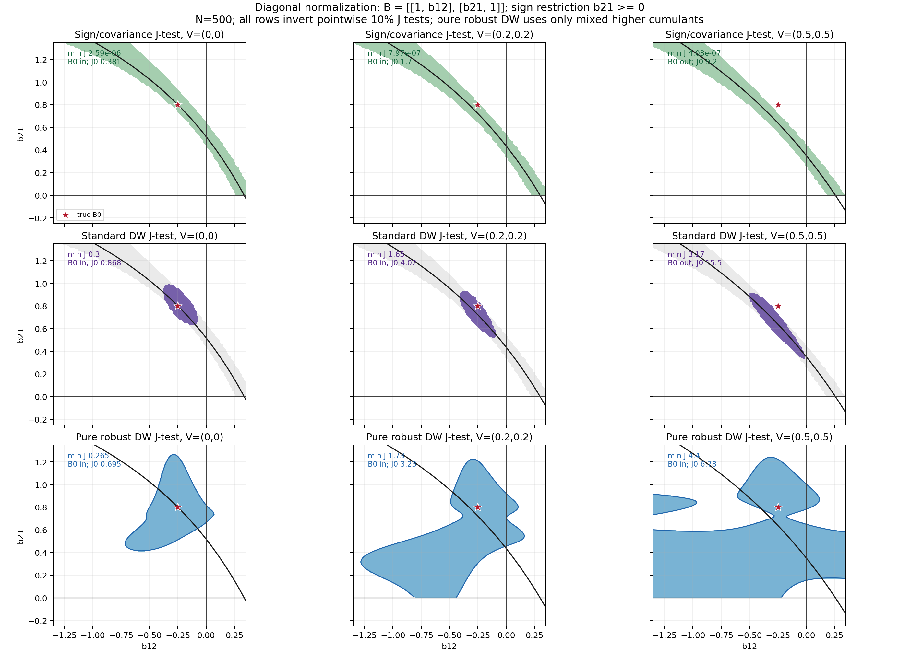

# Noise-Robust Sign-Restricted SVARs

Author: TODO

Date: 2026-06-05

## Abstract

Sign-restricted SVARs are usually presented as qualitative restrictions, but
the set they report is built from a covariance target. This paper studies the
simultaneous impact problem when the reduced-form residual is contaminated by
additive residual noise. In that case the usual sign-restricted set rotates a
factor of `B0 B0' + V`, not a factor of the structural covariance `B0 B0'`, so
the population sign set becomes a noisy pseudo-set. Drautzburg-Wright-style
higher-moment refinement remains well motivated under its no-noise maintained
null, but under residual noise it can sharpen the wrong target and return a
small accepted set that looks more informative than it is. The paper proposes a
validity-first robust comparison set that drops invalid second-order anchors
and uses mixed higher-cumulant moments of normalized candidate shocks. The
M0034 scale correction supersedes the earlier diagonal-anchor evidence; the
pure robust Figure 1 variant shows that the price of validity can be a much
wider set under noise. The recommendation is therefore
diagnostic: report standard DW and robust DW together, and treat standard-DW
precision unsupported by the robust set as a warning rather than as evidence of
sharper structural learning.

<!-- SOURCE-TRAIL: Use the M0034 pure robust Figure 1 variant and the M24 higher-cumulant derivation. Treat M0030/M37/M28/M29 diagonal-anchor evidence as superseded until M39 rebuilds it. -->
<!-- CONTRIBUTION-NOTE: The abstract's original contribution is the residual-noise pseudo-set warning and the DW-versus-robust-DW comparison diagnostic. -->

## 1. Introduction

Applied sign-restricted SVAR work often begins after the reduced-form residual
`u_t` has already been estimated. The next step is usually an impact
decomposition: find candidate structural impact matrices whose implied signs
match the researcher's qualitative restrictions. Under the no-noise benchmark,
the reduced-form covariance is `Sigma_u = B0 B0'`, so rotating a covariance
factor is a natural way to explore observationally equivalent structural
models. This paper asks what happens when the residual being decomposed is not
only structural signal but also contains additive residual noise.

<!-- SOURCE-TRAIL: Use sign-restriction overview sources, `kilian2016StructuralVectorAutoregressiveAnalysis93b03b`, and `arias2018InferenceBasedStructuralVector`. -->

The issue is not that sign restrictions are quantitative after all. The issue
is that the qualitative filter is applied to a covariance object. With
`u_t = B0 epsilon_t + eta_t` and `E eta_t eta_t' = V`, the covariance factor
being rotated solves `P_* P_*' = B0 B0' + V`. Unless the noise happens to be
absorbed by a harmless structural-coordinate rescaling, the resulting sign set
is a pseudo-set: it is internally coherent for the noisy covariance, but it is
not the no-noise economic set one would have reported from `B0 B0'`.

<!-- SOURCE-TRAIL: Use `vault/syntheses/Noisy residuals in recursive and sign-restricted SVARs.md` and the M25 column-rescaling obstruction. -->

Drautzburg-Wright-style refinement then creates a sharper version of the same
problem. Under its maintained no-noise null, independence restrictions on
recovered shocks are a useful way to refine a sign-admissible set. Under
residual noise, however, the recovered shocks from a noisy covariance-factor
candidate are not the structural shocks. A higher-moment test can therefore
reject the true normalized impact matrix while accepting a small region around
a least-rejected noisy target. The paper treats this as a robustness problem,
not as a criticism of the no-noise DW procedure on its own terms.

<!-- SOURCE-TRAIL: Use `drautzburg2023RefiningSetIdentificationVars` for the maintained-null comparator and `manuscript/derivations/standard-dw-j-test-under-noise.md` for the M25 working misspecification result. -->
<!-- TODO-NOTE: Do not promote the generic emptying result to theorem wording until the M25 proof audit is complete. -->

The constructive move is to report a second, deliberately more conservative
set. In a common normalized impact chart, the robust DW set applies the same
sign screen but drops the recovered-shock covariance moment and the
superseded diagonal-anchor `u` covariance moment. It keeps mixed
higher-cumulant restrictions of `z_t(B)=B^{-1}u_t`. Under the maintained
Gaussian residual-noise route, additive Gaussian noise changes contaminated
second moments but not the higher cumulants used in the pure robust stack. The
price is visible: when
structural shocks are close to Gaussian or higher moments are weak, the robust
set widens rather than producing sharp higher-moment identification.

<!-- SOURCE-TRAIL: Use `manuscript/derivations/dw-noise-robust-moments.md`, `manuscript/derivations/dw-robust-comparison-diagnostic.md`, and higher-moment SVAR caution sources. -->

### 1.1 Literature Positioning

This paper is closest to three literatures, but it uses them for a narrow
robustness question rather than for a broad survey. The first is the
sign-restricted SVAR literature. In that literature, sign restrictions describe
sets of admissible rotations, and careful reporting matters because selected
rotations or point summaries can understate set uncertainty. This paper accepts
that set-based starting point. Its additional question comes one step earlier:
if the covariance factor being rotated is a factor of `B0 B0' + V`, then even
the population sign set is already a noisy pseudo-set.

<!-- SOURCE-TRAIL: Use `kilian2016StructuralVectorAutoregressiveAnalysis93b03b` for sign-restriction geometry and `arias2018InferenceBasedStructuralVector` for set-inference and reporting cautions. -->
<!-- CONTRIBUTION-NOTE: The covariance-target contamination question is this manuscript's contribution, not a claim inherited from standard sign-restriction inference. -->

The second comparator is Drautzburg and Wright's independence refinement. Their
procedure is the right benchmark because it takes a sign-restricted set and
uses higher-moment independence restrictions to refine it under a maintained
no-noise model. This paper does not claim that refinement is invalid under
that model. It asks what the same researcher-facing refinement reports when
the reduced-form residual includes additive noise and the no-noise covariance
target is misspecified. The standard-DW set is therefore used as a
maintained-null comparator, while the robust set is a diagnostic object to
report beside it.

<!-- SOURCE-TRAIL: Use `drautzburg2023RefiningSetIdentificationVars` for the no-noise comparator and `manuscript/derivations/standard-dw-j-test-under-noise.md` for the manuscript's residual-noise misspecification route. -->
<!-- TODO-NOTE: Keep theorem-level claims about generic standard-DW emptying conditional on the M25 proof audit. -->

The third connection is the higher-moment SVAR and GMM literature. Those papers
show that non-Gaussian moments can carry structural information, but they also
make the assumptions and weak-moment risks explicit. The robust DW set follows
that discipline: it writes mixed higher cumulants as moment restrictions, uses
a GMM-style inversion language, and treats weak or Gaussian structural shocks
as an honest widening case. The robust set is not advertised as a uniformly
sharper estimator. It is meant to reveal when standard-DW precision depends on
a noisy covariance target that the robust moments do not support.

<!-- SOURCE-TRAIL: Use `guay2020IdentificationStructuralVectorAutoregressions`, `paper2020GeneralizedMethodMomentsEstimator`, `olea2022SvarIdentificationHigherMoments`, and `lewis2025IdentificationBasedHigherMoments`. -->
<!-- CONTRIBUTION-NOTE: The original contribution is the DW-versus-robust-DW comparison under residual noise, not the general idea that higher moments can identify SVARs. -->

The paper is organized around this comparison. Figure 1 varies Gaussian
residual noise and shows the main warning: the sign/covariance set moves,
standard DW can exclude the true normalized impact matrix, and robust DW
remains wider while containing it. Figure 2 holds residual noise fixed and
weakens structural non-Gaussianity, showing the limitation that robust DW's
higher-cumulant component needs informative higher moments. Table 1 then
reports the same story in the refreshed M29 Monte Carlo pass using the standard
pointwise chi-square critical values that an applied standard-DW researcher
would use under the no-noise null.

<!-- SOURCE-TRAIL: Use M28 for population/repeated-seed validation and M29 for the larger chi-square-primary Monte Carlo table. -->

<!-- SOURCE-TRAIL: Use sign-restriction overview sources, Drautzburg-Wright, and the noisy-residual synthesis. -->
<!-- CONTRIBUTION-NOTE: The original contribution is the noise-bias warning plus the standard-DW versus robust-DW comparison. -->

## 2. Noisy Sign Sets

TODO: Define the additive-noise SVAR, the standard sign-restricted covariance
rotation set, and the no-noise economic sign set. State and prove the noisy
pseudo-set result and the column-rescaling obstruction. Include an intuitive
figure that shows how residual noise moves or deforms the sign set.

<!-- SOURCE-TRAIL: Use the proposal note and `Noisy residuals in recursive and sign-restricted SVARs.md`. -->
<!-- DESIGN-NOTE: Keep the paper simultaneous and impact-only. Treat `u_t` as given; do not introduce VAR lag equations, dynamic IRFs, or horizon-specific sign restrictions in this version. -->
<!-- TODO-NOTE: Make this section visual and intuitive before the algebra. -->

## 3. Standard DW Under Residual Noise

TODO: Explain the standard no-noise Drautzburg-Wright refinement, why it is
well motivated under its maintained null, and why residual noise contaminates
the recovered-shock object. State the planned misspecification result: the
population refined set should generally be empty under noise, while finite
samples can still return a falsely small least-rejected set.

<!-- SOURCE-TRAIL: Use Drautzburg-Wright, higher-moment SVAR caution sources, and the noisy-residual synthesis. -->
<!-- SOURCE-TRAIL: Use `derivations/standard-dw-j-test-under-noise.md` for the M25 J-test inversion result: rich-stack generic emptying, structural-rescaling exceptions, finite-moment aliases, and least-rejected pseudo-candidates. -->
<!-- TODO-NOTE: Be fair: the target is not to criticize DW under its own null, but to show what changes under residual noise. -->
<!-- TODO-NOTE: Do not state generic emptying without the M25 assumptions and exceptions. -->

## 4. Robust DW Higher-Moment Set

TODO: Define the robust normalized candidate space, candidate transformed
residuals `z_t(B)=B^{-1}u_t`, and the pure higher-moment stack. Explain that
recovered-shock zero covariance is not imposed, the M0030 diagonal-anchor
`u` covariance moment is invalid under `diag(B)=1` without also imposing unit
shock variances, and the fourth-order restrictions are cumulants written as
moment equations.

<!-- SOURCE-TRAIL: Use `derivations/dw-noise-robust-moments.md`, Drautzburg-Wright, and higher-moment GMM sources. -->
<!-- TODO-NOTE: State the exact robust noise assumption. Gaussian residual noise is clean for transformed higher cumulants; broader noise requires another argument. -->
<!-- TODO-NOTE: Emphasize the efficiency tradeoff: the robust set should be wider because it profiles noisy diagonal variances and drops recovered-shock covariance restrictions. -->

## 5. Monte Carlo Robustness Check

This section should be read as the evidence map for the first draft. The two
figures give the reader the geometry first; the Monte Carlo table then checks
whether the same comparison survives repeated finite-sample draws. All three
objects use the same normalized bivariate impact chart and the same sign
screen, so the standard-DW and robust-DW accepted sets can be compared directly.

<!-- SOURCE-TRAIL: Use M27 for the common reporting chart, accepted shares, overlap, warning-rate, and truth-inclusion diagnostics. -->

### 5.1 Residual-Noise Grid

Figure 1 is the main story figure. Each column increases Gaussian residual
noise. The first row shows the standard sign/covariance set. The second row
adds the standard DW moment stack, including the no-noise covariance moment.
The third row uses the robust DW stack, which keeps the sign screen and mixed
higher cumulants while dropping invalid second-order anchors. The high-noise
column is the narrative anchor: standard DW looks sharp but rejects the true
normalized `B0`, while pure robust DW contains it at the cost of becoming wide.

**Figure 1. Residual-noise grid.** Rows report the sign/covariance set,
standard-DW set, and robust-DW set in the common normalized `B(b12,b21)` chart.
Columns increase Gaussian residual noise from `V=(0,0)` to `V=(0.5,0.5)`.
All rows invert pointwise 10 percent J tests. The robust-DW row profiles
no second-order anchor and uses only mixed higher cumulants. The high-noise
column shows the paper's main warning and limitation at once: standard DW
rejects true `B0` under the researcher-facing cutoff, while pure robust DW
contains it but accepts a large part of the chart.

<!-- SOURCE-TRAIL: Figure file `figures/fig_sign_dw_pure_robust_noise_grid.png`; generator `simulations/sign_dw_robust_noise_grid_figure.py --robust-mode pure`; diagnostic note `simulations/sign_dw_pure_robust_noise_grid_figure.md`. M28/M29 diagonal-anchor evidence is superseded until M39. -->

M28 checks the figure's population logic before the draft leans on it. At the
true normalized `B0`, the standard-DW population moment norm rises from
essentially zero with no noise to `0.135` in the high-noise case, while the
robust-DW population norm remains numerically zero under the maintained
diagonal Gaussian residual-noise condition. The same validation pass checks
grid-window sensitivity and repeated finite-sample seeds; the high-noise
standard-DW row rejects true `B0` across those repeated seeds at the pointwise
10 percent cutoff, while robust DW contains it in most draws.

<!-- TODO-NOTE: Translate the M28 diagnostics into final prose only after deciding how much numerical validation belongs in the main text versus an appendix. -->

### 5.2 Non-Gaussianity Grid

Figure 2 states the main limitation immediately after the main warning. It
holds residual noise fixed and weakens the structural shocks' higher moments
across columns. The robust-DW set stays noise-robust only because the maintained
diagonal Gaussian residual-noise condition leaves the off-diagonal covariance
target clean and higher cumulants unshifted. It is not a free source of
precision. When structural higher moments weaken, robust DW widens toward the
covariance band; in the Gaussian-shock limit, the higher-cumulant substack is
all-null.

**Figure 2. Non-Gaussianity grid.** Rows match Figure 1, but residual noise is
fixed while structural-shock non-Gaussianity weakens across columns. All rows
invert pointwise 10 percent J tests. The figure explains why the robust set is
a robustness check rather than a uniformly sharper estimator: when the
higher-moment signal fades, the robust set widens toward the covariance-anchor
band.

<!-- SOURCE-TRAIL: Figure file `figures/fig_sign_dw_robust_nongaussianity_grid.png`; generator `simulations/sign_dw_robust_nongaussianity_grid_figure.py`; M28 population and repeated-seed validation. -->

This limitation matters for the paper's recommendation. A wide robust set is
not a failed diagnostic by itself. It records the information deliberately lost
by dropping the noisy recovered-shock covariance target and profiling diagonal
noise variances. The warning object is directional: standard-DW accepted mass
outside the robust-DW set, or standard-DW rejection of the truth in simulations
when robust DW still contains it.

<!-- SOURCE-TRAIL: Use `manuscript/derivations/dw-robust-comparison-diagnostic.md` for the directional interpretation rule. -->

### 5.3 Monte Carlo Table

Table 1 reports the refreshed M29 finite-sample pass under the chi-square
critical values used as the main applied benchmark. The table is not a final
replication package, but it is strong enough for a first figure-led draft. The
high-noise row is the key comparison: standard DW includes true `B0` in only
0.050 of evaluation samples, while robust DW includes it in 0.900. The weak
and Gaussian structural-shock rows show the limitation from Figure 2 in
quantitative form: robust accepted shares rise to about 0.172 and 0.158, so the
robust object falls back toward the covariance anchor when higher moments carry
little identifying content.

**Table 1. Chi-square-primary Monte Carlo comparison.** The entries are M29
evaluation averages under standard pointwise chi-square critical values.
`S truth` and `R truth` are true-`B0` inclusion rates for standard DW and robust
DW. `S share` and `R share` are accepted-set shares on the normalized grid.
`d_S_not_subset_R` is the directional share of standard-DW accepted mass not
supported by robust DW. `Warning rate` fires when standard DW misses truth
while robust DW contains it, or when the directional unsupported-mass metric is
large enough to flag divergence.

| Scenario | S truth | R truth | S share | R share | d_S_not_subset_R | Warning rate |
|---|---:|---:|---:|---:|---:|---:|
| No noise, strong moments | 0.883 | 0.900 | 0.024 | 0.040 | 0.166 | 0.283 |
| Moderate Gaussian noise | 0.583 | 0.933 | 0.032 | 0.072 | 0.103 | 0.433 |
| High Gaussian noise | 0.050 | 0.900 | 0.040 | 0.117 | 0.242 | 0.850 |
| Weak structural higher moments | 0.617 | 0.933 | 0.153 | 0.172 | 0.379 | 0.767 |
| Gaussian structural shocks | 0.667 | 0.967 | 0.153 | 0.158 | 0.405 | 0.917 |
| Skewed residual noise | 0.600 | 0.950 | 0.029 | 0.069 | 0.085 | 0.383 |

<!-- SOURCE-TRAIL: M29 refreshed run in `simulations/m29_calibrated_monte_carlo.md` and machine-readable output `simulations/output/m29_calibrated_monte_carlo.json`. -->

The audit rows in M29 should stay secondary in the main text. No-noise
repeated calibration is a size check for the maintained no-noise benchmark.
Scenario-specific truth calibration is an oracle diagnostic: in the high-noise
case the standard-DW cutoff must rise sharply to cover true `B0`, and the
accepted set becomes much wider. The truth-point residual bootstrap is also an
audit because it uses the known simulation truth and often restores truth
inclusion by making accepted sets nearly uninformative. These rows quantify
calibration cost; they are not the applied procedure being critiqued.

<!-- DESIGN-NOTE: Keep chi-square rows as the central evidence after U0026. Use repeated-sample, oracle, and bootstrap cutoffs only to explain finite-sample size and calibration cost. -->

<!-- SOURCE-TRAIL: Use KnowledgeVault replication assets only as starting points; final figure commands must live in `replication/README.md`. -->
<!-- SOURCE-TRAIL: Use `derivations/dw-robust-comparison-diagnostic.md` for the M27 definitions of the reported standard-DW set, robust-DW set, critical-value convention, directional overlap metric, and interpretation boundaries. -->
<!-- DESIGN-NOTE: Run an early Monte Carlo triage after the analytical J-test inversion result before polishing final figures or a large replication suite. -->
<!-- DESIGN-NOTE: Use standard pointwise chi-square critical values as the primary applied M29 benchmark; repeated-sample, oracle, and truth-bootstrap cutoffs are audit rows only. -->
<!-- TODO-NOTE: Include an intuitive first figure, a false-sharpening figure, and a robust-set comparison figure. -->
<!-- TODO-NOTE: In simulation tables, report accepted shares, empty-set frequencies, Jaccard overlap, standard-DW mass outside robust-DW, truth inclusion, and least-rejected candidates. -->
<!-- TODO-NOTE: Report inconclusive and weak cases honestly. -->

## 6. Conclusion

TODO: Restate the practical recommendation: report the robust DW set beside the
standard DW set. If they overlap, the standard refinement is less suspect; if
they diverge, treat standard DW precision as a warning sign rather than
evidence of sharper structural learning.

## References

TODO: Use the citation style chosen in `manuscript-rules.md` and the BibTeX
snapshot in `../bibliography/references.bib`.
