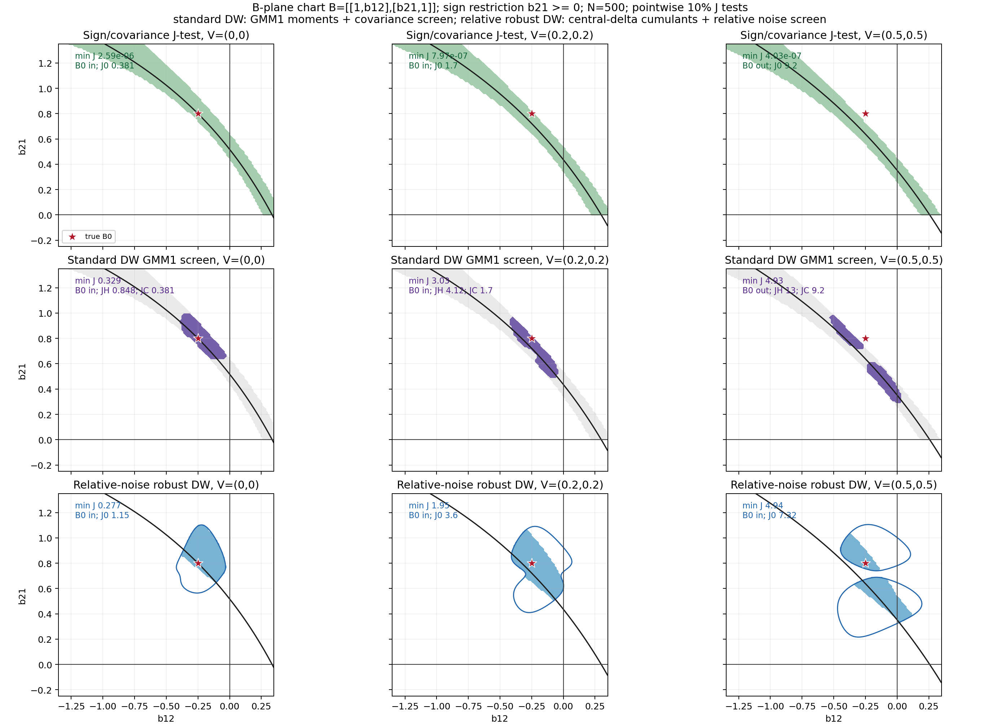
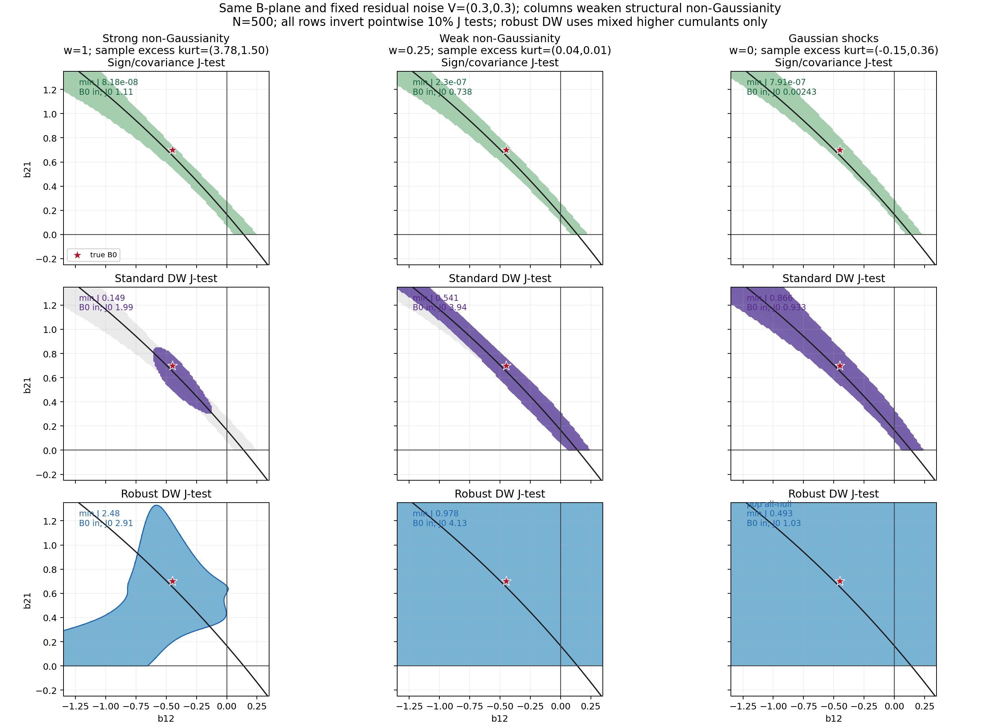
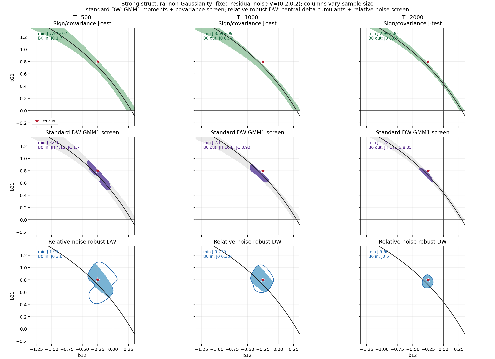

# Noise-Robust Sign-Restricted SVARs

Author: TODO

Date: 2026-06-05

## Abstract

Sign restrictions set-identify structural impact matrices by combining
economically motivated signs with the requirement that recovered structural
shocks are mutually uncorrelated. In non-Gaussian SVARs, this set can be
sharpened by imposing higher-order independence restrictions in the spirit of
Drautzburg and Wright. This paper shows that idiosyncratic residual noise can
break both steps. If the observed residual is
\(u_t=B_0\varepsilon_t+\eta_t\), a standard no-noise sign-restricted SVAR
matches the covariance of \(u_t\), not the covariance of the structural signal
\(B_0\varepsilon_t\). The resulting identified set can be biased and need not
contain the true impact matrix. Higher-moment refinement can then sharpen the
wrong target, producing a small accepted set that looks precise while moving
further away from the structural object of interest. This paper proposes a
noise-robust refinement that separates non-Gaussian structural shocks from
Gaussian residual noise. The researcher states a maximum ratio of residual-noise
variance to structural-signal variance, and higher cumulants are used only in
forms that are blind to Gaussian noise. Source-correct simulations with the
bivariate Drautzburg-Wright GMM1 higher-moment menu show standard sign
restrictions drifting under noise, standard higher-moment refinement excluding
the truth, and the robust refinement usually keeping the true impact matrix in
the reported set while regaining precision when the variance-ratio bound is
informative.

<!-- SOURCE-TRAIL: Use the M0036 relative-noise Figure 1 candidate, the M40 screen audit, the M0035 absolute-bound comparison, the M0034 pure robust variant, the M24 higher-cumulant derivation, M49 for the source-correct GMM1 menu, M56 for generated-moment inference, and the M52 evidence rebuild. -->
<!-- CONTRIBUTION-NOTE: The abstract's original contribution is the residual-noise pseudo-set warning and the DW-versus-robust-DW comparison diagnostic. -->

## 1. Introduction

Sign-restricted SVARs are popular because they identify structural shocks with
relatively little economic structure. Once the reduced-form residual \(u_t\) is
available, the researcher searches for impact matrices \(B\) such that the
recovered shocks \(e_t(B)=B^{-1}u_t\) are mutually uncorrelated and the entries
of \(B\) satisfy economically motivated sign restrictions. Compared with
recursive zero restrictions or external instruments, this looks robust: the
researcher does not choose a recursive ordering or a single proxy, but reports
the set of impact matrices consistent with signs and orthogonality.

<!-- SOURCE-TRAIL: Use sign-restriction overview sources, `kilian2016StructuralVectorAutoregressiveAnalysis93b03b`, and `arias2018InferenceBasedStructuralVector`. -->

This paper shows that the same orthogonality requirement becomes fragile when
the observed residual contains idiosyncratic noise. In the simultaneous
impact model
\[
u_t=B_0\varepsilon_t+\eta_t,
\]
\(B_0\varepsilon_t\) is the structural signal and \(\eta_t\) is residual noise.
A standard sign-restricted SVAR that ignores \(\eta_t\) treats \(u_t\) as if it
were entirely structural signal. Even at the true impact matrix, the recovered
object \(B_0^{-1}u_t=\varepsilon_t+B_0^{-1}\eta_t\) need not have uncorrelated
components. Equivalently, the usual covariance factor is a factor of
\(B_0B_0' + V\), not a factor of \(B_0B_0'\). The sign-restricted set is then
identified from the wrong covariance object and may no longer contain the true
impact matrix, even in population.

<!-- SOURCE-TRAIL: Use `vault/syntheses/Noisy residuals in recursive and sign-restricted SVARs.md` and the M25 column-rescaling obstruction. -->

The problem becomes sharper once higher moments are used for refinement. The
motivation for Drautzburg-Wright-style refinement is clear in a no-noise SVAR:
sign restrictions often leave a wide set, while non-Gaussian structural shocks
carry additional information about independence beyond zero covariance. A
researcher can therefore discard sign-admissible impact matrices whose
recovered shocks are uncorrelated but still dependent at third or fourth
order. Under residual noise, however, the refinement is applied to shocks
recovered from a misspecified no-noise model. It can reject the true impact
matrix and select a small region around a noisy pseudo-target. The visual
danger is a false sense of precision: the accepted set gets smaller, but the
target being sharpened is no longer the structural target.

<!-- SOURCE-TRAIL: Use `drautzburg2023RefiningSetIdentificationVars` for the maintained-null comparator and `manuscript/derivations/standard-dw-j-test-under-noise.md` for the M25 working misspecification result. -->
<!-- TODO-NOTE: Do not promote the generic emptying result to theorem wording until the M25 proof audit is complete. -->

The proposed solution keeps the logic of sign restrictions but changes the
maintained model. Instead of pretending that all variation in \(u_t\) is
structural signal, the researcher reports impact matrices that are compatible
with signs, with diagonal Gaussian residual noise, and with an explicit
residual-noise-to-signal bound. In the bivariate version used here, the bound is
\(\nu_i\le \rho s_i\): residual-noise variance in coordinate \(i\) can be at
most a fraction \(\rho\) of the corresponding structural-shock variance. This
bound makes the sign-restricted set robust to noise up to the specified ratio.
It also makes the cost transparent. A larger allowed noise ratio gives a more
robust but wider set; a smaller ratio gives more precision but requires a
stronger signal-to-noise assumption.

The higher-moment part of the solution exploits a simple cumulant fact. If
residual noise is Gaussian and independent of the structural shocks, it changes
second moments but has no cumulants above order two. Mixed third and fourth
cumulants of \(B^{-1}u_t\) can therefore be used to refine the noise-robust
sign set without reusing the invalid no-noise covariance restriction. This is
the sense in which the robust DW refinement separates non-Gaussian structural
shocks from Gaussian residual noise. It does not claim that higher moments
always give a sharp estimator. When structural shocks are nearly Gaussian, the
robust set widens, and that widening is part of the diagnostic.

<!-- SOURCE-TRAIL: Use `manuscript/derivations/dw-noise-robust-moments.md`, `manuscript/derivations/dw-robust-comparison-diagnostic.md`, and higher-moment SVAR caution sources. -->

The preliminary simulation evidence follows the same sequence. Figure 1 varies
Gaussian residual noise. The standard sign-restricted set moves away from the
true impact matrix, the source-correct standard-DW GMM1 screen can become
tight while excluding the truth, and the variance-ratio robust refinement
remains truth-containing in the high-noise design. Figure 2 weakens structural
non-Gaussianity and shows the limitation: without informative higher moments,
robust refinement is wider. Figure 3 varies the sample size, and Table 1
summarizes the repeated-sample comparison. The recommendation is diagnostic:
report the standard DW set and the robust DW set together, and treat standard
DW precision unsupported by the robust set as a warning sign.

<!-- SOURCE-TRAIL: Use M0036 and the M40 audit for Figure 1, plus M52 for the rebuilt Figure 1, Figure 2, Figure 3, and Monte Carlo evidence. -->

### 1.1 Literature Positioning

This paper is closest to three literatures, but it uses them for a narrow
robustness question rather than for a broad survey. The first is the
sign-restricted SVAR literature. In that literature, sign restrictions describe
sets of admissible rotations, and careful reporting matters because selected
rotations or point summaries can understate set uncertainty. This paper accepts
that set-based starting point. Its additional question comes one step earlier:
if the covariance factor being rotated is a factor of \(B_0B_0' + V\), then even
the population sign set is already a noisy pseudo-set.

<!-- SOURCE-TRAIL: Use `kilian2016StructuralVectorAutoregressiveAnalysis93b03b` for sign-restriction geometry and `arias2018InferenceBasedStructuralVector` for set-inference and reporting cautions. -->
<!-- CONTRIBUTION-NOTE: The covariance-target contamination question is this manuscript's contribution, not a claim inherited from standard sign-restriction inference. -->

The second comparator is Drautzburg and Wright's independence refinement. Their
procedure is the right benchmark because it takes a sign-restricted set and
uses higher-moment independence restrictions to refine it under a maintained
no-noise model. This paper does not claim that refinement is invalid under
that model. It asks what the same researcher-facing refinement reports when
the reduced-form residual includes additive noise and the no-noise covariance
target is misspecified. The standard-DW set is therefore used as a
maintained-null comparator, while the robust set is a diagnostic object to
report beside it.

<!-- SOURCE-TRAIL: Use `drautzburg2023RefiningSetIdentificationVars` for the no-noise comparator and `manuscript/derivations/standard-dw-j-test-under-noise.md` for the manuscript's residual-noise misspecification route. -->
<!-- TODO-NOTE: Keep theorem-level claims about generic standard-DW emptying conditional on the M25 proof audit. -->

The third connection is the higher-moment SVAR and GMM literature. Those papers
show that non-Gaussian moments can carry structural information, but they also
make the assumptions and weak-moment risks explicit. The robust DW set follows
that discipline: it writes mixed higher cumulants as moment restrictions, uses
a GMM-style inversion language, and treats weak or Gaussian structural shocks
as an honest widening case. The robust set is not advertised as a uniformly
sharper estimator. It is meant to reveal when standard-DW precision depends on
a noisy covariance target that the robust moments do not support.

<!-- SOURCE-TRAIL: Use `guay2020IdentificationStructuralVectorAutoregressions`, `paper2020GeneralizedMethodMomentsEstimator`, `olea2022SvarIdentificationHigherMoments`, and `lewis2025IdentificationBasedHigherMoments`. -->
<!-- CONTRIBUTION-NOTE: The original contribution is the DW-versus-robust-DW comparison under residual noise, not the general idea that higher moments can identify SVARs. -->

The paper is organized around this comparison. Figure 1 varies Gaussian
residual noise and shows the main warning with the source-correct GMM1
implementation: the sign/covariance set moves, the standard-DW row can exclude
the true normalized impact matrix, and robust DW
remains wider while containing it once explicit relative noise-scale
information is added. Figure 2 holds residual noise fixed and weakens
structural non-Gaussianity, showing the limitation that robust DW's
higher-cumulant component needs informative higher moments. Figure 3 asks
whether the comparison tightens with sample size, and Table 1 reports the
rebuilt Monte Carlo comparison under researcher-facing chi-square cutoffs.

<!-- SOURCE-TRAIL: Use M0036 and the M40 audit for the current Figure 1 candidate, plus M52 for the rebuilt Figure 1/Figure 2/Figure 3 and Monte Carlo evidence. -->

<!-- SOURCE-TRAIL: Use sign-restriction overview sources, Drautzburg-Wright, and the noisy-residual synthesis. -->
<!-- CONTRIBUTION-NOTE: The original contribution is the noise-bias warning plus the standard-DW versus robust-DW comparison. -->

## 2. Sign Restrictions and Noisy SVARs

This section starts with the standard object and then adds noise. The main text
uses a bivariate simultaneous impact model. There are no VAR lags, dynamic
impulse responses, or horizon-specific restrictions in the first version of
the paper. The residual \(u_t\) is already in hand, and the question is which
impact matrices can be reported from it.

In the no-noise benchmark,

\begin{equation}
u_t = B_0\varepsilon_t,\qquad
E(\varepsilon_t)=0,\qquad
E(\varepsilon_t\varepsilon_t')=I .
\end{equation}

\comment{Just note that we are already imposing the unit variance condition here! thats good.}

The matrix \(B_0\) is the structural impact matrix. The vector
\(\varepsilon_t=(\varepsilon_{1t},\varepsilon_{2t})'\) contains structural
shocks normalized to have unit variances and zero covariance. For any candidate
impact matrix \(B\), the recovered shocks are

\begin{equation}
e_t(B)=B^{-1}u_t .
\end{equation}

A sign-restricted SVAR keeps candidates whose recovered shocks are uncorrelated
and whose impact matrix satisfies the chosen sign restrictions. If \(R(B)\ge0\)
denotes the sign screen, the population no-noise identified set can be written
as

\begin{equation}
\mathcal S_0 =
\{B:\ R(B)\ge0,\quad E[e_{1t}(B)e_{2t}(B)]=0\},
\label{eq:no-noise-sign-j-set}
\end{equation}

\comment{However, you missed the unit variance condition in the S_0 definition! I think we can just write \mathcal S_0 =
\{B:\ R(B)\ge0,\quad E[e_{t}(B)e_{t}(B)]=I\}. then we also dont need to write about sign label and scale normalization after the equation at all. }

\comment{i deleted a whole paragraph here
after the usual sign, label, and scale normalizations. The familiar rotation
representation is a convenient way to compute the same object: if \comment{just note that we are implicitly using the unit variance condition in this equation! thats fine but i just try to point out that you are using it all the time. But actually, lets drop this equation enteriely. we will not work with the rotation stuff and just invert J to get S_0. so lets keep it simple.}
\(P_0P_0'=E(u_tu_t')=B_0B_0'\), then \(B=P_0Q\) automatically gives
uncorrelated recovered shocks for every orthogonal \(Q\). Equation
\eqref{eq:no-noise-sign-j-set} \commet{something is broken with the equation ref because i only see(???)} is useful here because it displays the
orthogonality restriction that noise will violate.

Now suppose the observed residual contains additive residual noise:

\comment{add that by assumption V is diagonal. moreover, is E(\varepsilon_t\eta_t')=0 well defined in terms of the dimensions? i know that you are trying to write that epsilon and eta are uncorrelated...maybe lets not write this moment but simply write out that they are independent?}

\begin{equation}
u_t = B_0\varepsilon_t+\eta_t,\qquad
E(\eta_t)=0,\qquad
E(\eta_t\eta_t')=V,\qquad
E(\varepsilon_t\eta_t')=0 .
\end{equation}

The covariance of the observed residual is

\begin{equation}
\Sigma_u=E(u_tu_t')=B_0B_0'+V .
\end{equation}

\comment{I dont like this definition. i think we dont need it}

*Definition 1 (`def:diagonal-noise-svar`, additive-noise impact model). The
first-version model is the bivariate simultaneous residual system
\(u_t=B_0\varepsilon_t+\eta_t\), where \(B_0\) is nonsingular, the structural
shocks are mean zero, mutually independent, and normalized, and the additive
residual noise is mean zero and independent of the structural shocks. The main
figures use diagonal \(V\). The first version does not model VAR lag dynamics,
dynamic impulse responses, or horizon-specific sign restrictions.*

If the researcher ignores \(\eta_t\), the standard sign-restricted SVAR treats
\(\Sigma_u\) as if it were generated only by structural shocks. That changes
the object being identified. At the true impact matrix,

\begin{equation}
e_t(B_0)=B_0^{-1}u_t
=\varepsilon_t+B_0^{-1}\eta_t ,
\end{equation}

so the recovered-shock covariance is

\begin{equation}
E[e_t(B_0)e_t(B_0)']
= I+B_0^{-1}VB_0^{-1'} .
\end{equation}

Unless the off-diagonal element of \(B_0^{-1}VB_0^{-1'}\) is zero, the shocks
recovered at \(B_0\) are correlated. Thus \(B_0\) fails the no-noise
orthogonality condition in \eqref{eq:no-noise-sign-j-set}. In the rotation
language, the standard procedure instead rotates a factor \(P_*\) satisfying
\(P_*P_*'=B_0B_0'+V\). It then reports

\begin{equation}
\mathcal S_* =
\{P_*Q:\ Q'Q=I,\quad R(P_*Q)\ge0\}.
\end{equation}

*Definition 2 (`def:noisy-sign-pseudo-set`, noisy sign pseudo-set). The noisy
sign pseudo-set is the population sign-restricted set \(\mathcal S_*\) obtained
by rotating a factor of \(B_0B_0'+V\) rather than a factor of \(B_0B_0'\). It is
internally coherent for the noisy covariance target, but it is generally not
the no-noise structural set \(\mathcal S_0\).*

The only benign case is a structural-coordinate rescaling. If the noisy
covariance can be written as \(B_0D^2B_0'\) for a positive diagonal matrix
\(D\), then a rescaled version of the true impact matrix has the same sign
pattern and can factor the noisy covariance. This requires

\begin{equation}
B_0(D^2-I)B_0' = V,
\qquad
D^2-I = B_0^{-1}VB_0^{-1'} .
\label{eq:column-rescaling-obstruction}
\end{equation}

For generic residual noise, \(B_0^{-1}VB_0^{-1'}\) is not diagonal. The noisy
covariance cannot be absorbed by positive column scales, and the standard
sign-restricted set is shifted away from the structural impact matrix. In
extreme cases the shift can cross a sign boundary: the noisy covariance may
make every covariance-compatible impact matrix with uncorrelated recovered
shocks put a disputed entry on the wrong side of zero. Figure 1 below shows
the less dramatic but more common version of the same mechanism: as the noise
variance increases, the sign/covariance set moves in the normalized impact
chart before higher moments are used.

*Proposition 1 (`prop:noisy-sign-pseudo-set`, noisy sign-set bias). In the
additive-noise impact model, the standard covariance-factor sign set reports
factors of \(B_0B_0'+V\), so \(B_0\) itself is included only when \(V=0\). If
signs are interpreted up to positive structural-shock rescaling, a rescaled
true impact matrix \(B_0D\) can survive the noisy covariance target only when
\(B_0^{-1}VB_0^{-1'}\) is diagonal up to the accepted sign and label
convention. Outside that structural-coordinate rescaling case, the population
set reported by a no-noise sign-restricted SVAR is a noisy pseudo-set and may
exclude the true impact shape.*

In finite samples the same idea can be written as a J-test inversion. For a
candidate \(B\), let

\begin{equation}
\widehat m_{2,T}(B)=T^{-1}\sum_{t=1}^T e_{1t}(B)e_{2t}(B)
\end{equation}

be the sample recovered-shock covariance. A no-noise sign-restricted inversion
accepts candidates satisfying

\begin{equation}
\mathcal S_{J,T}(c_2)=
\left\{
B:\ R(B)\ge0,\quad
J_{2,T}(B)=T\widehat m_{2,T}(B)'\widehat W_{2,T}\widehat m_{2,T}(B)\le c_2
\right\}.
\end{equation}

The rotation approach hides this test because rotations of a covariance factor
make the recovered shocks uncorrelated by construction. The J-test view makes
the source of bias explicit: in the noisy model, the no-noise moment
\(E[e_{1t}(B_0)e_{2t}(B_0)]=0\) is generally false.

<!-- SOURCE-TRAIL: Use the proposal note, `Noisy residuals in recursive and sign-restricted SVARs.md`, and the M25 column-rescaling obstruction. -->
<!-- DESIGN-NOTE: Keep the paper simultaneous and impact-only. Treat \(u_t\) as given; do not introduce VAR lag equations, dynamic IRFs, or horizon-specific sign restrictions in this version. -->
<!-- TODO-NOTE: A future figure can isolate a sign-flip design. The current Figure 1 already shows the continuous set movement caused by residual noise. -->

## 3. Drautzburg-Wright Refinement Under Noise

The previous section used only second moments. Drautzburg-Wright-style
refinement adds higher moments to exploit non-Gaussian structural shocks. The
no-noise logic is easiest to see from the general recovered shocks
\(e_t(B)=B^{-1}u_t\). A sign-admissible \(B\) may make
\(E[e_{1t}(B)e_{2t}(B)]=0\), but zero covariance is weaker than independence.
If the structural shocks are non-Gaussian and independent, incorrect rotations
can leave higher-order dependence in the recovered shocks. DW refinement
shrinks the sign-restricted set by testing those higher-order restrictions.

<!-- SOURCE-TRAIL: M52 rebuilt the simulation code with the M49 source-correct bivariate Drautzburg-Wright GMM1 higher-moment menu plus a separate B-plane covariance screen. -->

M49 verifies that Drautzburg and Wright's moment-based refinement uses
standardized raw co-skewness and co-kurtosis products, not fourth cumulants. In
the source-native rotation chart, the recovered shocks are already
covariance-normalized, so the higher-moment GMM vector does not include a
separate covariance moment. The same notation introduced in Section 2 is
enough: \(e_t(B)=B^{-1}u_t\). In the no-noise benchmark,
\(e_t(B_0)=\varepsilon_t\), and the structural shocks are centered with unit
variances by normalization. If the common B-plane chart is used outside the
source-native rotation normalization, the product moments below are evaluated
after the usual centering and unit-variance scaling of the recovered-shock
coordinates \(e_{it}(B)\). No separate headline variable is needed. The
bivariate GMM1 higher-moment menu is

\begin{equation}
g_{DW,1}(B)=
\begin{bmatrix}
E\{e_{1t}(B)^2e_{2t}(B)\}\\
E\{e_{1t}(B)e_{2t}(B)^2\}\\
E\{e_{1t}(B)^3e_{2t}(B)\}\\
E\{e_{1t}(B)^2e_{2t}(B)^2\}-1\\
E\{e_{1t}(B)e_{2t}(B)^3\}
\end{bmatrix}.
\end{equation}

The corresponding GMM2 menu drops only the symmetric fourth product
\(E\{e_{1t}(B)^2e_{2t}(B)^2\}-1\). It keeps the singleton fourth products
\(E\{e_{1t}(B)^3e_{2t}(B)\}\) and
\(E\{e_{1t}(B)e_{2t}(B)^3\}\). In the manuscript's
diagonal-normalized B-plane, a no-noise covariance screen may still be added
to mimic the standard covariance factorization, but that screen is a
manuscript chart component rather than a DW higher-moment entry.

In the no-noise model, \(g_{DW,1}(B_0)=0\). A sample inversion keeps
sign-admissible candidates whose estimated moment vector is small:

\begin{equation}
\mathcal D_T(c_S)=
\left\{
B:\ R(B)\ge0,\quad
J_{S,T}(B)=T\widehat g_{DW,T}(B)'\widehat W_{S,T}
\widehat g_{DW,T}(B)\le c_S
\right\}.
\label{eq:standard-dw-j-test-inversion}
\end{equation}

This is a useful refinement under the maintained no-noise null. It is also the
place where residual noise can turn a wide but honest set into a narrow and
misleading one. Under the noisy model,

\begin{equation}
e_t(B)=B^{-1}B_0\varepsilon_t+B^{-1}\eta_t .
\end{equation}

At \(B=B_0\), the B-plane no-noise covariance screen is generally nonzero:

\begin{equation}
E\{e_{1t}(B_0)e_{2t}(B_0)\}
=\left[B_0^{-1}VB_0^{-1'}\right]_{12}.
\end{equation}

Thus a standard no-noise inversion in the B-plane can reject the true impact
matrix before the higher moments even matter. If the researcher instead works
with rotations of the noisy covariance factor \(P_*P_*'=B_0B_0'+V\), the
recovered shocks are
uncorrelated by construction, but the candidate impact matrices are factors of
the noisy covariance. Writing \(B(Q)=P_*Q\),

\begin{equation}
e_t(Q)=B(Q)^{-1}u_t
=M(Q)\varepsilon_t+\zeta_t(Q),
\qquad
M(Q)=Q'P_*^{-1}B_0 .
\end{equation}

The non-Gaussian structural shocks are then mixed by \(M(Q)\). A rich
higher-moment stack can vanish only when this mixing matrix recovers
structural coordinates up to scale, sign, and label:

\begin{equation}
M(Q)=D\Pi ,
\end{equation}

where \(D\) is diagonal and \(\Pi\) is a signed permutation matrix. Combining
this with the noisy covariance factorization gives the same structural
rescaling condition as in Section 2:

\begin{equation}
B_0^{-1}VB_0^{-1'}=\Pi'D^{-2}\Pi-I .
\end{equation}

Outside these special cases, no covariance-whitened standard-DW candidate both
matches the noisy covariance and recovers independent structural shocks. With a
finite moment stack there can still be accidental zeros or least-rejected
pseudo-candidates, but those are properties of the misspecified noisy target.

*Proposition 2 (`prop:standard-dw-misspecification`, standard DW under
residual noise). Consider the additive-noise impact model with independent
non-Gaussian structural shocks, independent Gaussian residual noise, and a
compact sign-admissible candidate set bounded away from singular impact
matrices. A standard no-noise DW inversion imposes recovered-shock covariance
and higher-order independence moments on \(e_t(B)=B^{-1}u_t\). In population,
a zero of a rich standard-DW independence stack can occur only when residual
noise is equivalent to a diagonal structural-coordinate rescaling, up to sign
and label aliases; finite GMM1/GMM2 moment stacks can also create accidental
pseudo-zeros unless a no-alias condition rules them out. When the population
moment vector is bounded away from zero on the sign-admissible set,
fixed-critical-value inversion is asymptotically empty. In finite samples, the
same inversion can nevertheless look precise by concentrating near a
least-rejected noisy pseudo-target.*

The proposition is deliberately conditional, not an unconditional finite-GMM1
theorem. The M47 audit passes the rich-stack proof gate under the stated
Gaussian-noise, ICA/rich-moment, compactness, and no-singular-boundary
conditions, while keeping finite-stack aliases visible. The paper's practical
claim does not require accusing DW of failing under its own null. The point is
narrower: if the no-noise null is applied to residuals that contain additive
noise, the refinement sharpens a misspecified object. The current second row
of Figure 1 illustrates this failure mode with the source-correct bivariate
GMM1 higher-moment menu, intersected with the separate B-plane covariance
screen.

<!-- SOURCE-TRAIL: Use Drautzburg-Wright, higher-moment SVAR caution sources, and the noisy-residual synthesis. -->
<!-- SOURCE-TRAIL: Use `derivations/standard-dw-j-test-under-noise.md` for the M25 J-test inversion result: rich-stack generic emptying, structural-rescaling exceptions, finite-moment aliases, and least-rejected pseudo-candidates. -->
<!-- SOURCE-TRAIL: Use `derivations/m47-standard-dw-proof-gate-audit.md` for the M47 conditional pass: rich-stack/ICA proof gate, compactness condition, structural-coordinate rescaling exception, and finite-GMM1 alias limitation. -->
<!-- SOURCE-TRAIL: Use `derivations/m49-dw-source-and-noisy-moment-audit.md` for the source-correct bivariate GMM1/GMM2 moment menus and `simulations/m52_source_correct_evidence.md` for the implemented GMM1 rebuild. -->

## 4. Noise-Robust Sign and DW Sets

The robust construction begins by changing the null model for sign
restrictions. Instead of requiring the residual covariance to be explained
entirely by structural shocks, the researcher allows part of each residual
variance to be idiosyncratic noise. In the bivariate normalized chart, write

\begin{equation}
B(a,b)=
\begin{bmatrix}
1 & a\\
b & 1
\end{bmatrix},
\qquad
1-ab\neq 0 .
\end{equation}

The diagonal normalization fixes the scale of the impact matrix. The remaining
second-moment scale is carried by the structural-shock variances
\(s_1,s_2\) and the residual-noise variances \(\nu_1,\nu_2\). Let \(S\) denote
the residual covariance used in the inversion. For a candidate \(B(a,b)\), the
noise-robust covariance screen asks whether there exist
\(s_1,s_2,\nu_1,\nu_2\) such that

\begin{equation}
\begin{aligned}
S_{11} &= s_1+a^2s_2+\nu_1,\\
S_{12} &= bs_1+as_2,\\
S_{22} &= b^2s_1+s_2+\nu_2,\\
s_i &>0,\qquad 0\le \nu_i\le \rho s_i .
\end{aligned}
\label{eq:relative-noise-covariance-screen}
\end{equation}

The scalar \(\rho\) is the maximum residual-noise-to-signal ratio chosen by the
researcher. The simulations use \(\rho=0.5\): each residual-noise variance may
be at most one half of the corresponding structural-shock variance. A larger
\(\rho\) makes the sign set more robust to noise but less precise. A smaller
\(\rho\) recovers precision only by assuming a cleaner signal.

Equivalently, after profiling out \(\nu_1,\nu_2\), the screen is

\begin{equation}
\begin{aligned}
s_1+a^2s_2 &\le S_{11}\le (1+\rho)s_1+a^2s_2,\\
b^2s_1+s_2 &\le S_{22}\le b^2s_1+(1+\rho)s_2,\\
S_{12} &= bs_1+as_2 .
\end{aligned}
\end{equation}

This is not a DW higher-moment restriction and not a normalization. It is
substantive identifying information about how much idiosyncratic residual
noise the researcher is willing to allow.

The next step is to regain some of the efficiency lost by allowing noise. For
each candidate \(B\), define

\begin{equation}
z_t(B)=B^{-1}u_t
=B^{-1}B_0\varepsilon_t+B^{-1}\eta_t .
\end{equation}

It is useful to name the transformed-noise component
\(\xi_t(B)=B^{-1}\eta_t\). Let
\(\Omega(B)=\operatorname{Var}\{\xi_t(B)\}\) denote the covariance of that
unobserved transformed noise, and let
\(S(B)=\operatorname{Var}\{z_t(B)\}\) denote the covariance of the full
transformed residual that the researcher can compute for a candidate \(B\).
At the truth,

\begin{equation}
z_t(B_0)=\varepsilon_t+\xi_t(B_0),
\qquad
S(B_0)=I+\Omega(B_0).
\end{equation}

Thus \(S_{ij}(B_0)\) is not a known no-noise normalization constant. For
example, \(S_{ii}(B_0)=1+\Omega_{ii}(B_0)\), and
\(S_{ij}(B_0)=\Omega_{ij}(B_0)\) for \(i\neq j\). The entries of \(S(B)\) are
nuisance covariance terms of the transformed observed residual, not
restrictions that force recovered shocks to be uncorrelated.

The robust higher-moment route uses the following maintained condition.

*Assumption 1 (`ass:gaussian-residual-noise`, robust-noise condition). The
residual noise is independent of the structural shocks and Gaussian. Therefore
every linear transform \(B^{-1}\eta_t\) contributes only through first and
second moments. This assumption makes the displayed transformed higher-order
moment conditions robust to Gaussian noise; it does not make recovered-shock
variances or recovered-shock covariances equal to their no-noise targets.*

Under Assumption 1, \(\xi_t(B_0)\) is Gaussian because it is a linear
transformation of Gaussian residual noise. Gaussian variables have no
cumulants above order two, and cumulants of independent sums add. Since the
structural shocks are mutually independent, every mixed higher cumulant of
\(z_t(B_0)=\varepsilon_t+\xi_t(B_0)\) vanishes. This is the population reason
the robust higher-moment restrictions hold at \(B_0\).

For third-order entries, the mixed cumulants are just centered third moments,
so the restrictions can be written as \(E\{z_1(B)^2z_2(B)\}=0\) and
\(E\{z_1(B)z_2(B)^2\}=0\). Fourth-order entries are different. Raw fourth
products include covariance terms even when the mixed fourth cumulant is zero.
For example, at \(B_0\) under Assumption 1,

\begin{equation}
\operatorname{cum}\{z_1,z_2,z_2,z_2\}
=E(z_1z_2^3)-3S_{12}(B)S_{22}(B)=0 .
\end{equation}

The other fourth-order entries use the same cumulant-product logic. The
step-by-step expansions behind these equations are recorded in
`manuscript/derivations/m54-stepwise-transformed-noise-moments.md`, while
`manuscript/derivations/m56-robust-cumulant-gmm-generated-moment-audit.md`
records the sample generated-moment treatment.

Let \(s_{ij}(B)=E\{z_i(B)z_j(B)\}\). The Gaussian-noise-blind moment stack is
written directly as moment equations:

\begin{equation}
G_H(B)=
\begin{bmatrix}
E\{z_1(B)^2z_2(B)\}\\
E\{z_1(B)z_2(B)^2\}\\
E\{z_1(B)^3z_2(B)\}-3s_{11}(B)s_{12}(B)\\
E\{z_1(B)^2z_2(B)^2\}
-s_{11}(B)s_{22}(B)-2s_{12}(B)^2\\
E\{z_1(B)z_2(B)^3\}-3s_{22}(B)s_{12}(B)
\end{bmatrix}.
\label{eq:dw-higher-cumulant-moment-stack}
\end{equation}

The first two entries are the centered third-product conditions. The last
three entries are fourth-order conditions with the covariance-product
subtractions required for Gaussian-noise robustness. The covariance terms
\(s_{ij}(B)\) are nuisance quantities used to form those fourth-order moment
conditions. They are not imposed as no-noise restrictions such as
\(s_{12}(B)=0\) or \(s_{11}(B)=s_{22}(B)=1\). This is the central difference
from standard DW under residual noise. The distinction matters because DW raw
fourth products are shifted by Gaussian residual-noise covariance terms, while
the robust fourth-order conditions subtract those covariance-product terms.
In sample, the researcher does not recover \(\eta_t\) or \(\xi_t(B)\). For
each candidate \(B\), compute \(z_t(B)=B^{-1}u_t\), center those transformed
residuals, estimate \(S_{ij}(B)\) from their sample covariance, and plug those
entries into the third- and fourth-order equations. For instance,

\begin{equation}
\widehat g_{1222,T}(B)
=T^{-1}\sum_t \widetilde z_{1t}(B)\widetilde z_{2t}(B)^3
-3\widehat S_{12}(B)\widehat S_{22}(B).
\end{equation}

M56 clarifies that this is a generated smooth moment, because
\(\widehat S_{12}(B)\) and \(\widehat S_{22}(B)\) are themselves sample
averages. Its weighting should therefore come from a primitive-moment
delta-method covariance, an equivalent augmented nuisance-covariance system,
or an explicit calibration route, not from treating each concentrated
expression as one primitive row-level moment.

M54 keeps the manuscript in the common `diag(B)=1` chart. The source-native
DW unit-variance scaling is internal to the recovered-shock standardization in
Section 3; it does not require a manuscript-wide rotation-chart switch for the
first paper.

*Definition 3 (`def:robust-dw-higher-moment-set`, variance-ratio robust DW
set). For a researcher-chosen \(\rho\), the variance-ratio robust DW set is the
set of normalized candidates \(B\in\mathcal B_N\) such that \(R(B)\ge0\), the
covariance screen in \eqref{eq:relative-noise-covariance-screen} is feasible,
and
\[
T\widehat G_H(B)'\widehat W_{H,T}\widehat G_H(B)\le c_H .
\]
The set deliberately drops no-noise covariance factorization, unit-variance
recovered-shock restrictions, and recovered-shock zero covariance as equality
moments. In finite samples, \(\widehat W_{H,T}\) must account for the generated
covariance-product entries in \(\widehat G_H(B)\).*

The pure higher-moment fallback is obtained by dropping the covariance
screen and keeping only \(R(B)\ge0\) and the \(G_H(B)\) inversion. It is the
most validity-first object, but it can be wide because higher moments alone
do not recover all second-moment scale information. The variance-ratio screen
adds that information back only through an explicit signal-to-noise bound.

*Proposition 3 (`prop:robust-dw-higher-moment-validity`, robust higher-moment
validity). Under the normalized bivariate chart, independent structural
shocks, Assumption 1, and the local higher-moment rank condition that each
shock has at least one informative third- or fourth-order entry in the stack,
the true normalized impact matrix has \(G_H(B_0)=0\). If the true diagonal
residual-noise variances also satisfy \(\nu_i\le\rho s_i\), then the true
impact shape satisfies the variance-ratio covariance screen. The robust DW set
therefore keeps the true impact matrix in the population target while using
non-Gaussianity to refine the noise-robust sign set.*

The third row of Figure 1 illustrates the construction. It starts from the
same sign restrictions as the standard procedure, allows residual noise up to
the specified residual-noise-to-signal ratio, and then sharpens the remaining
set with moment conditions that Gaussian noise cannot shift. The result is not
a uniformly smaller set. It is a different robustness object: precision is
reported only when it survives the stated noise allowance and the higher-moment
restrictions.

<!-- SOURCE-TRAIL: Use `derivations/dw-noise-robust-moments.md`, `derivations/m40-variance-ratio-robust-dw-screen-audit.md`, `simulations/sign_dw_relative_noise_robust_grid_figure.md`, Drautzburg-Wright, and higher-moment GMM sources. -->
<!-- TODO-NOTE: The 50 percent noise-to-shock variance bound is identifying information, not a normalization. Final theorem wording still needs the M25 proof audit and final replication packaging. M52 implements full central-moment delta weighting for the generated fourth-cumulant rows, but final replication can still add heavier calibration checks. -->

## 5. Monte Carlo Robustness Check

This section should be read as the evidence map for the first draft. The
figures give the reader the geometry first; the Monte Carlo table then checks
whether the same comparison survives repeated finite-sample draws. All reported
objects use the same normalized bivariate impact chart and the same sign
screen, so the standard-DW and robust-DW accepted sets can be compared directly.
After M52, the standard-DW rows use the M49 source-correct bivariate GMM1
higher-moment menu, with the no-noise covariance restriction kept as a separate
B-plane screen. The robust rows use the M56 generated-moment route through full
central-moment delta weighting for the fourth-cumulant rows, plus the
variance-ratio covariance-decomposition screen.

<!-- SOURCE-TRAIL: Use M27 for the common reporting chart, accepted shares, overlap, warning-rate, and truth-inclusion diagnostics. -->

### 5.1 Residual-Noise Grid

Figure 1 is the main story figure. Each column increases Gaussian residual
noise. The first row shows the standard sign/covariance set. The second row
adds the source-correct bivariate standard-DW GMM1 higher-moment stack,
intersected with the separate no-noise covariance screen in the common B-plane.
The third row uses the robust DW stack, which keeps the sign screen and mixed
higher cumulants while replacing invalid zero-covariance anchors with a
relative-noise covariance screen. The high-noise column is the narrative
anchor: standard DW looks sharp but rejects the true normalized \(B_0\), while
relative robust DW contains it with a visibly smaller set than the pure
higher-cumulant fallback.

**Figure 1. Residual-noise grid.** Rows report the sign/covariance set,
source-correct standard-DW GMM1 screen, and robust-DW set in the common normalized \(B(b_{12},b_{21})\) chart.
Columns increase Gaussian residual noise from \(V=(0,0)\) to \(V=(0.5,0.5)\).
All rows invert pointwise 10 percent criteria for their displayed moment
stacks. The standard-DW row uses the M49 source-correct GMM1 higher products
`112`, `122`, `1112`, `1122`, and `1222`, plus a separate covariance-screen
cutoff. The robust-DW row uses generated higher-cumulant moments with
central-delta weighting and adds the covariance-decomposition feasibility screen implied by
\(0\le \nu_i \le 0.5\operatorname{Var}(\varepsilon_i)\) for diagonal residual-noise variances. The
high-noise column shows the paper's main warning: standard DW rejects true
\(B_0\) under the researcher-facing cutoff, while relative robust DW contains it.

<!-- SOURCE-TRAIL: Figure file `figures/fig_sign_dw_relative_noise_robust_grid.png`; generator `simulations/sign_dw_robust_noise_grid_figure.py --robust-mode relative`; diagnostic note `simulations/sign_dw_relative_noise_robust_grid_figure.md`; audit note `derivations/m40-variance-ratio-robust-dw-screen-audit.md`; M52 validation note `simulations/m52_source_correct_evidence.md`; M49 source audit `derivations/m49-dw-source-and-noisy-moment-audit.md`; M56 generated-moment audit `derivations/m56-robust-cumulant-gmm-generated-moment-audit.md`. -->

M52 checks the finite-sample logic for the source-correct statistic. In the
fixed-grid diagnostics, the high-noise column has the standard-DW GMM1 screen
missing true \(B_0\), while relative robust DW contains it and passes the
variance-ratio screen. In the repeated-sample Monte Carlo, the high-noise
chi-square row gives standard-DW truth inclusion of \(0.000\) and robust-DW
truth inclusion of \(0.833\).

### 5.2 Non-Gaussianity Grid

Figure 2 states the main limitation immediately after the main warning. It
holds residual noise fixed and weakens the structural shocks' higher moments
across columns. The robust-DW set stays noise-robust because the maintained
diagonal Gaussian residual-noise condition leaves higher cumulants unshifted,
and it regains precision only through the explicit variance-ratio screen. It is
not a free source of identification. When structural higher moments weaken,
robust DW widens toward the covariance-decomposition band; in the
Gaussian-shock limit, the higher-cumulant substack is all-null and the screen
does the remaining work.

**Figure 2. Non-Gaussianity grid.** Rows match Figure 1, but residual noise is
fixed while structural-shock non-Gaussianity weakens across columns. All rows
invert pointwise 10 percent criteria. The robust row uses the same
variance-ratio proposal as Figure 1: generated mixed higher-cumulant inversion
plus the screen \(0\le \nu_i\le 0.5\operatorname{Var}(\varepsilon_i)\). The
figure explains why the robust set is a robustness check rather than a
uniformly sharper estimator.

<!-- SOURCE-TRAIL: Figure file `figures/fig_sign_dw_robust_nongaussianity_grid.png`; generator `simulations/sign_dw_robust_nongaussianity_grid_figure.py`; M52 validation note `simulations/m52_source_correct_evidence.md`. -->

This limitation matters for the paper's recommendation. A wide robust set is
not a failed diagnostic by itself. It records the information deliberately lost
by dropping the noisy recovered-shock covariance target and profiling diagonal
noise variances. The warning object is directional: standard-DW accepted mass
outside the robust-DW set, or standard-DW rejection of the truth in simulations
when robust DW still contains it.

<!-- SOURCE-TRAIL: Use `manuscript/derivations/dw-robust-comparison-diagnostic.md` for the directional interpretation rule. -->

### 5.3 Sample-Size Grid

Figure 3 asks whether the same comparison tightens as the sample grows. It
holds the Figure 1 structural non-Gaussianity calibration and Figure 2 residual
noise fixed, then varies \(T=500,1000,2000\). In this fixed draw, the standard
DW GMM1 screen becomes smaller and misses the true \(B_0\) at the larger sample sizes,
while the variance-ratio robust row keeps the true point and shrinks around
the covariance-decomposition band.

**Figure 3. Sample-size grid.** Rows match Figures 1 and 2. Columns vary the
sample size with strong structural higher moments and fixed residual noise
\(V=(0.2,0.2)\). The robust row again uses generated mixed higher-cumulant
inversion plus the variance-ratio covariance-decomposition screen.

<!-- SOURCE-TRAIL: Figure file `figures/fig_sign_dw_sample_size_robust_grid.png`; generator `simulations/sign_dw_sample_size_robust_grid_figure.py`; M52 validation note `simulations/m52_source_correct_evidence.md`. -->

### 5.4 Monte Carlo Table

Table 1 reports the M52 source-correct Monte Carlo evidence under the primary
researcher-facing chi-square cutoffs. The standard row uses the bivariate DW
GMM1 higher-moment menu and the separate no-noise covariance screen. The robust
row uses the variance-ratio proposal, and the covariance-decomposition screen
is applied both to accepted grid points and to the truth-inclusion calculation.
`S truth` and `R truth` are true-\(B_0\) inclusion rates for standard DW and
robust DW. `R feasible` is the fraction of evaluation samples in which the
hard variance-ratio screen is feasible at the true \(B_0\). `S share` and
`R share` are accepted-set shares on the normalized grid.
`d_S_not_subset_R` is the directional share of standard-DW accepted mass not
supported by robust DW.

**Table 1. M52 chi-square-primary Monte Carlo comparison.** Entries are
evaluation averages from 24 replications per scenario on a \(41\times 41\)
grid, with 60 truth-calibration replications retained as audit output. The
standard-DW chi-square cutoff is \(9.236\) for five GMM1 higher moments, plus
the separate covariance-screen cutoff \(2.706\). The robust cutoff is \(9.236\)
for five generated higher-cumulant moments with central-delta weighting.

| Scenario | S truth | R truth | R feasible | S share | R share | d_S_not_subset_R | Warning rate |
|---|---:|---:|---:|---:|---:|---:|---:|
| No noise, strong moments | 0.792 | 0.875 | 0.958 | 0.017 | 0.027 | 0.204 | 0.375 |
| Moderate Gaussian noise | 0.417 | 0.875 | 1.000 | 0.027 | 0.057 | 0.174 | 0.583 |
| High Gaussian noise | 0.000 | 0.833 | 0.958 | 0.029 | 0.062 | 0.161 | 0.875 |
| Weak structural higher moments | 0.667 | 0.833 | 0.958 | 0.101 | 0.157 | 0.202 | 0.333 |
| Gaussian structural shocks | 0.458 | 0.875 | 1.000 | 0.112 | 0.173 | 0.175 | 0.625 |
| Skewed residual noise | 0.458 | 0.875 | 1.000 | 0.020 | 0.043 | 0.214 | 0.542 |

<!-- SOURCE-TRAIL: M52 rebuilt run in `simulations/m52_source_correct_evidence.md` and machine-readable output `simulations/output/m52_source_correct_evidence.json`. Historical M45 outputs remain in `simulations/m45_variance_ratio_evidence.md` and `simulations/output/m45_variance_ratio_evidence.json` but used the old standard-DW hybrid and approximate robust weighting. Historical M29 outputs remain in `simulations/m29_calibrated_monte_carlo.md` but used the superseded diagonal-anchor robust row. -->

The skewed-residual-noise row is a stress case, not validation of the robust
Gaussian-noise route. It violates Assumption 1, so its favorable truth-inclusion
numbers should not be read as evidence that the same cumulant argument covers
non-Gaussian residual noise without additional restrictions.

The audit rows stay secondary. The no-noise repeated calibration is a size
check, while the scenario-truth calibration is an oracle diagnostic. In the
high-noise case, scenario-truth calibration raises the standard-DW accepted
share to \(0.125\), showing the calibration cost of forcing the misspecified
standard statistic to cover the truth. These audit rows are not the applied
procedure being critiqued.

<!-- SOURCE-TRAIL: Use KnowledgeVault replication assets only as starting points; final figure commands must live in `replication/README.md`. -->
<!-- SOURCE-TRAIL: Use `derivations/dw-robust-comparison-diagnostic.md` for the M27 definitions of the reported standard-DW set, robust-DW set, critical-value convention, directional overlap metric, and interpretation boundaries. -->
<!-- DESIGN-NOTE: M52 keeps standard pointwise chi-square critical values as the primary applied benchmark; the robust row now uses full central-moment delta weighting for generated cumulants. Repeated-sample and oracle cutoffs remain audit rows only. -->
<!-- TODO-NOTE: In future simulation tables, report accepted shares, empty-set frequencies, Jaccard overlap, standard-DW mass outside robust-DW, truth inclusion, and least-rejected candidates. -->
<!-- TODO-NOTE: Report inconclusive and weak cases honestly. -->

## 6. Conclusion

This paper studies a narrow robustness problem in sign-restricted SVARs. If the
observed reduced-form residual contains additive idiosyncratic noise, the usual
covariance factor is a factor of \(B_0B_0'+V\), not \(B_0B_0'\). The standard
sign-restricted set can therefore be a noisy pseudo-set, and a
Drautzburg-Wright-style higher-moment refinement can sharpen that pseudo-set
instead of the structural impact matrix.

The proposed response is diagnostic. Report the standard DW set beside a
variance-ratio robust DW set that allows diagonal Gaussian residual noise,
uses only Gaussian-noise-blind higher cumulants for refinement, and adds
second-moment precision only through an explicit residual-noise-to-signal
bound. Agreement between the two sets makes the standard refinement less
suspect. Divergence, especially standard-DW precision that is not supported by
the robust set, should be read as a warning about covariance-target
misspecification rather than as evidence of sharper structural learning.

The first version deliberately keeps the scope small: a bivariate simultaneous
impact model, no empirical application, no dynamic impulse responses, and no
claim that the robust comparison proves literal measurement error. The next
step is to audit the standard-DW proof and move the figure and table code into
a self-contained replication package.

## References

TODO: Use the citation style chosen in `manuscript-rules.md` and the BibTeX
snapshot in `../bibliography/references.bib`.
